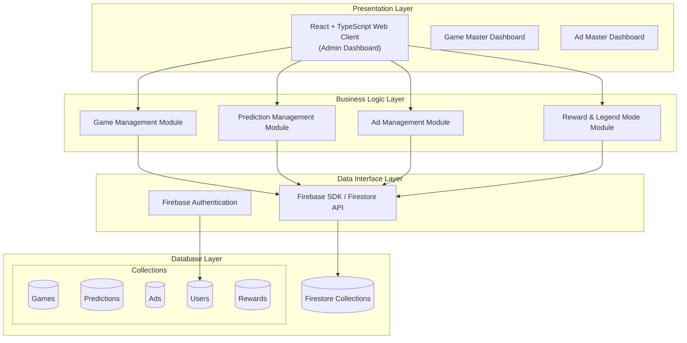

# Architecture

## System Architecture Module Explanations

| **Module** | **Layer** | **Explanation / Why it’s a module** |
|------------|-----------|-------------------------------------|
| React + TypeScript Web Client | Presentation | Provides the main web interface for Game Masters and Ad Masters to manage games, predictions, and ads (UC1–UC8). Separating it allows the front-end to evolve independently as requirements grow. |
| Game Master Dashboard | Presentation | Tailored UI for Game Masters to create games (UC1), manage prediction windows (UC2), create/select questions (UC3), mark correct answers (UC4), and activate Legend Mode (UC8). Its separation ensures clear workflows focused on game operations. |
| Ad Master Dashboard | Presentation | A dedicated interface for Ad Masters to upload (UC5), preview (UC7), and manage ads (UC6). Keeping it separate supports role-based access and simplifies ad-related workflows. |
| Game Management Module | Business | Implements the core logic for creating and managing games (FR1, FR8), including handling video streams, session state, and Legend Mode. Isolating this module keeps game operations independent from other business logic. |
| Prediction Management Module | Business | Handles the opening and closing of prediction windows (UC2), saving player responses, linking questions (UC3), and scoring based on correct answers (UC4). It’s modularized to keep prediction-related logic cohesive and easy to maintain. |
| Ad Management Module | Business | Encapsulates all advertisement business rules, including uploading, scheduling, displaying, and previewing ads (UC5–UC7). Its isolation ensures ad features can evolve without affecting core gameplay. |
| Reward & Legend Mode Module | Business | Manages the logic for awarding points, leaderboard updates, and running Legend Mode sessions (UC4, UC8). It’s separated to allow scoring and reward systems to scale or change independently of game logic. |
| Firebase SDK / Firestore API | Data Interface | Provides a communication layer between the business modules and the database, handling data persistence for games, predictions, ads, users, and rewards. Abstracting this layer allows changes to backend services without affecting higher layers. |
| Firebase Authentication | Data Interface | Manages secure user authentication and role-based access control, enforcing that only authorized Game Masters and Ad Masters can access the system (NR2). Its separation isolates security logic from application logic. |
| Firestore Collections | Database | The primary persistent storage for all application data. Organizing data into collections supports clear domain boundaries and efficient queries. |
| Games Collection | Database | Stores details about each game session, including video stream URLs and whether it’s live or in Legend Mode (UC1, UC8). |
| Predictions Collection | Database | Stores prediction questions, player responses, and outcomes, supporting prediction windows and scoring (UC2–UC4). |
| Ads Collection | Database | Stores advertisement assets, metadata, and schedules for display during games (UC5–UC7). |
| Users Collection | Database | Stores user accounts and authentication data for both administrators and players, enabling secure access and tracking (NR2). |

