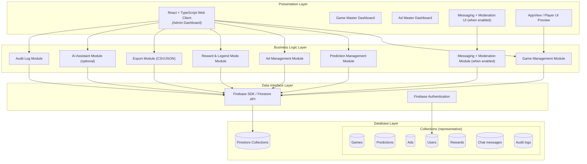

# Architecture

```mermaid
flowchart TB
    subgraph Presentation_Layer["Presentation Layer"]
        UI["React + TypeScript Web Client<br/>(Admin Dashboard)"]
        GMUI["Game Master Dashboard"]
        AMUI["Ad Master Dashboard"]
        MsgUI["Messaging + Moderation UI (when enabled)"]
        AppViewUI["AppView / Player UI Preview"]
    end

    subgraph Business_Layer["Business Logic Layer"]
        GMService["Game Management Module"]
        PredService["Prediction Management Module"]
        AdService["Ad Management Module"]
        RewardService["Reward & Legend Mode Module"]
        MsgService["Messaging + Moderation Module (when enabled)"]
        ExportService["Export Module (CSV/JSON)"]
        AiService["AI Assistant Module (optional)"]
        AuditService["Audit Log Module"]
    end

    subgraph Data_Interface_Layer["Data Interface Layer"]
        FirebaseSDK["Firebase SDK / Firestore API"]
        Auth["Firebase Authentication"]
    end

    subgraph Database_Layer["Database Layer"]
        Firestore[(Firestore Collections)]
        subgraph Collections["Collections (representative)"]
            Games[(Games)]
            Predictions[(Predictions)]
            Ads[(Ads)]
            Users[(Users)]
            Rewards[(Rewards)]
            Messages[(Chat messages)]
            AuditLogs[(Audit logs)]
        end
    end

    %% Communication arrows
    UI --> GMService
    UI --> PredService
    UI --> AdService
    UI --> RewardService
    UI --> ExportService
    UI --> AiService
    UI --> AuditService
    MsgUI --> MsgService
    AppViewUI --> GMService

    GMService --> FirebaseSDK
    PredService --> FirebaseSDK
    AdService --> FirebaseSDK
    RewardService --> FirebaseSDK
    MsgService --> FirebaseSDK
    ExportService --> FirebaseSDK
    AiService --> FirebaseSDK
    AuditService --> FirebaseSDK

    FirebaseSDK --> Firestore
    Auth --> Users
```
## System Architecture Module Explanations

| **Module** | **Layer** | **Explanation / Why it’s a module** |
|------------|-----------|-------------------------------------|
| React + TypeScript Web Client | Presentation | Provides the main web interface for Game Masters and Ad Masters to manage games, predictions, ads, and newer operational workflows (drafts, exports, history review, optional chat moderation, optional AI) (UC1–UC17). Separating it allows the front-end to evolve independently as requirements grow. |
| Game Master Dashboard | Presentation | Tailored UI for Game Masters to create games (UC1), manage prediction windows (UC2), create/select/reorder questions (UC3, UC10), mark correct answers (UC4), activate Legend Mode (UC8), manage drafts (UC9), configure hotkeys (UC11), review history (UC13), moderate chat when enabled (UC14), preview player UI (UC15), and use optional AI assistance (UC16). Its separation ensures clear workflows focused on game operations. |
| Ad Master Dashboard | Presentation | A dedicated interface for Ad Masters to upload (UC5), preview (UC7), and manage ads (UC6). Keeping it separate supports role-based access and simplifies ad-related workflows. |
| Messaging + Moderation UI | Presentation | Operator-facing workflows for session messaging and player chat moderation when the feature set is enabled for a deployment (UC14). |
| AppView / Player UI Preview | Presentation | In-admin preview surfaces that help operators validate player-facing layouts and messaging during live operations (UC15). |
| Game Management Module | Business | Implements the core logic for creating and managing games (FR1, FR8), including handling video streams, session state, Legend Mode, and draft/resume flows (FR20). Isolating this module keeps game operations independent from other business logic. |
| Prediction Management Module | Business | Handles the opening and closing of prediction windows (UC2), saving player responses, linking questions (UC3), scoring based on correct answers (UC4), and question ordering changes during a session (FR21). It’s modularized to keep prediction-related logic cohesive and easy to maintain. |
| Ad Management Module | Business | Encapsulates all advertisement business rules, including uploading, scheduling, displaying, and previewing ads (UC5–UC7). Its isolation ensures ad features can evolve without affecting core gameplay. |
| Reward & Legend Mode Module | Business | Manages the logic for awarding points, leaderboard updates, and running Legend Mode sessions (UC4, UC8). It’s separated to allow scoring and reward systems to scale or change independently of game logic. |
| Messaging + Moderation Module | Business | Encapsulates chat/messaging workflows and moderation actions behind explicit services so safety rules, permissions, and UI state stay consistent (FR25). |
| Export Module (CSV/JSON) | Business | Provides reusable export functionality across operational screens (Game History, Audit Logs, leaderboards). It ensures exports match the same client-side filters/search that the operator applies in the UI. |
| AI Assistant Module (optional) | Business | Provides an optional assistant UI + service layer that can answer operator questions and streamline workflows when an AI provider is configured; it should not block core gameplay/admin functionality when disabled or unconfigured. |
| Audit Log Module | Business | Aggregates and presents administrative changes for operational accountability (FR28). |
| Firebase SDK / Firestore API | Data Interface | Provides a communication layer between the business modules and the database, handling data persistence for games, predictions, ads, users, and rewards. Abstracting this layer allows changes to backend services without affecting higher layers. |
| Firebase Authentication | Data Interface | Manages secure user authentication and role-based access control, enforcing that only authorized Game Masters and Ad Masters can access the system (NR2). Its separation isolates security logic from application logic. |
| Firestore Collections | Database | The primary persistent storage for all application data. Organizing data into collections supports clear domain boundaries and efficient queries. |
| Games Collection | Database | Stores details about each game session, including video stream URLs and whether it’s live or in Legend Mode (UC1, UC8). |
| Predictions Collection | Database | Stores prediction questions, player responses, and outcomes, supporting prediction windows and scoring (UC2–UC4). |
| Ads Collection | Database | Stores advertisement assets, metadata, and schedules for display during games (UC5–UC7). |
| Users Collection | Database | Stores user accounts and authentication data for both administrators and players, enabling secure access and tracking (NR2). |
| Messages / Chat Collection | Database | Stores player chat messages and/or operator broadcast messages depending on product configuration (UC14). |
| Audit Logs Collection | Database | Stores administrative audit events for review and incident follow-up (UC17). |

