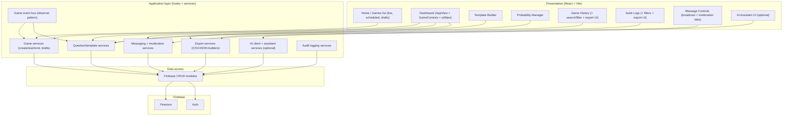

# Play by Play Admin - Development Guide

## Table of Contents

1. [Overview](#overview)
2. [Technology Stack](#technology-stack)
3. [Prerequisites](#prerequisites)
4. [Environment Setup](#environment-setup)
5. [Project Structure](#project-structure)
6. [Configuration Files](#configuration-files)
7. [Running the Application](#running-the-application)
8. [Testing Guide](#testing-guide)
9. [Troubleshooting](#troubleshooting)

---

## Overview

**Play by Play Admin** is a React-based admin dashboard application designed for managing game sessions with real-time communication. The application provides authenticated users with a comprehensive interface for game control, message handling, badge management, and app state management.

### Key Features

- **Real-time Game Management**: Create and manage live game sessions
- **Draft Games**: Save incomplete game setup and resume later
- **Question System**: Predefined templates and on-the-fly custom questions
- **Template Builder**: Create/manage reusable question sets (including ordering)
- **Achievement Badges**: Create and award badges to players
- **Keyboard Hotkeys**: Fast workflow with keyboard shortcuts (including combination hotkeys)
- **Game History + Reporting**: Search/filter past games and export CSV/JSON snapshots
- **Audit Logs + Export**: Review admin actions and export CSV/JSON snapshots
- **Messaging + Moderation**: Operator broadcasts plus player chat moderation workflows (profanity/AI flags, depending on configuration)
- **AI Assistant (optional)**: In-app assistant for operator workflows (provider-dependent)
- **AppView Emulation**: Preview player-facing experience inside the admin dashboard
- **Firebase Integration**: Authentication and real-time database
- **Type-Safe Development**: Full TypeScript support
- **Observer Pattern Architecture**: Decoupled event-driven system for game events

---

## System Architecture Overview

### Module map (high level)

This is a concise map of the major **runtime modules** in the admin app and how data flows between them. It is meant to complement the more detailed ASCII diagram below.



### High-Level Architecture Diagram

```
┌─────────────────────────────────────────────────────────────────────────────┐
│                           PLAY BY PLAY ADMIN                                │
├─────────────────────────────────────────────────────────────────────────────┤
│                                                                              │
│  ┌──────────────────┐                      ┌──────────────────────────┐   │
│  │   React UI Layer │                      │   Authentication Layer   │   │
│  │                  │                      │                          │   │
│  │ • Dashboard      │  ◄────────────────►  │ • Login                 │   │
│  │ • Game Controls  │                      │ • Register              │   │
│  │ • Badge Manager  │                      │ • Auth Context          │   │
│  │ • Template Build │                      │ • Protected Routes      │   │
│  │ • Players Lookup │                      │ • Auth Hooks            │   │
│  │ • Custom Hotkeys │                      └──────────────────────────┘   │
│  │ • Legends Mgr    │                                                     │
│  │ • Probability    │                                                     │
│  └──────────────────┘                                                     │
│            │                                                              │
│            ▼                                                              │
│  ┌──────────────────────────────────────────────────────────────────┐    │
│  │         Service Layer (Business Logic)                           │    │
│  │                                                                  │    │
│  │  ┌──────────────┐  ┌──────────────┐  ┌──────────────┐          │    │
│  │  │ GameService  │  │ QuestionSvc  │  │ BadgeService │          │    │
│  │  └──────────────┘  └──────────────┘  └──────────────┘          │    │
│  │                                                                  │    │
│  │  ┌──────────────┐  ┌──────────────┐  ┌──────────────┐          │    │
│  │  │UserStatsService                  │  MessageService         │    │
│  │  │PlayerLookupService            │  │ AuditService │          │    │
│  │  └──────────────┘  └──────────────┘  └──────────────┘          │    │
│  │                                                                  │    │
│  └────────────────────────────────────────────────────────────────┘    │
│                │                   │                                    │
│                ▼                   ▼                                    │
│  ┌──────────────────────┐    ┌──────────────────────┐                 │
│  │  EVENT SYSTEM (Core) │    │  CRUD Operations     │                 │
│  │                      │    │                      │                 │
│  │ GameEventEmitter     │    │ • firebaseGameCrud   │                 │
│  │ (Subject/Publisher)  │    │ • firebaseQuestCrud  │                 │
│  │                      │    │ • firebaseUserCrud   │                 │
│  │ Events:              │    │ • firebaseBadgeCrud  │                 │
│  │ • answer:set         │    │ • firebaseAuthCrud   │                 │
│  │ • question:opened    │    │ • firebaseMessageCrud                 │
│  │ • question:closed    │    │                      │                 │
│  │ • game:started       │    │ (Firestore queries)  │                 │
│  │ • game:ended         │    └──────────────────────┘                 │
│  └──────────────────────┘                  │                          │
│            │                               ▼                          │
│            │                    ┌──────────────────────┐              │
│            │                    │   FIREBASE (Backend) │              │
│            │                    │                      │              │
│            │                    │ • Firestore DB       │              │
│            │                    │ • Authentication     │              │
│            │                    │ • Real-time Updates  │              │
│            │                    └──────────────────────┘              │
│            │                                                          │
│            ▼                                                          │
│  ┌──────────────────────────────────────────────────────────────┐   │
│  │  OBSERVER PATTERN (Event Subscribers)                        │   │
│  │                                                              │   │
│  │  ┌──────────────────┐  ┌──────────────────┐               │   │
│  │  │UserStatsObserver │  │GameLeaderboardObs│               │   │
│  │  │                  │  │                  │               │   │
│  │  │• answer:set      │  │• answer:set      │               │   │
│  │  │• Updates stats   │  │• Updates game LB │               │   │
│  │  └──────────────────┘  └──────────────────┘               │   │
│  │                                                              │   │
│  │  ┌──────────────────┐                                       │   │
│  │  │GroupLeaderboardObs                                       │   │
│  │  │                  │                                       │   │
│  │  │• answer:set      │                                       │   │
│  │  │• Updates group LB│                                       │   │
│  │  └──────────────────┘                                       │   │
│  └──────────────────────────────────────────────────────────────┘   │
│                                                                      │
└─────────────────────────────────────────────────────────────────────────────┘
```

### Architecture Layers

#### 1. **UI Layer (React Components)**
- Entry point for all user interactions
- Components for game management, drafts, dashboard (AppView), question templates, badges, player lookup, game history, audit logs, messaging/moderation, and optional AI assistant UI
- Communicates with services via custom hooks
- Updates state reactively

#### 2. **Authentication Layer**
- Manages user authentication state
- Provides context for protected routes
- Handles login, registration, and session management

#### 3. **Service Layer (Business Logic)**
- Core application logic encapsulated in service classes
- Services implement business rules independently
- Examples: GameService, Question/Template services, BadgeService, UserStatsService, messaging/moderation services, export services, optional AI assistant services
- Services coordinate with CRUD layer and event system

#### 4. **Event System (Observer Pattern - Core)**
- **GameEventEmitter**: Central pub/sub bus for game domain events
- Decouples services and allows reactive updates
- Enables independent scaling of event subscribers
- See [Observer Design Pattern](#observer-design-pattern) section below

#### 5. **CRUD Layer (Data Operations)**
- Direct Firebase database operations
- Each entity has dedicated CRUD file (gamesCrud, questionsCrud, etc.)
- May include additional collections/modules for messaging/moderation depending on feature rollout
- Handles read, create, update, delete operations
- Tested via integration tests against Firebase Emulator

#### 6. **Firebase Backend**
- Firestore database for persistent data storage
- Authentication service for user management
- Real-time listeners for live updates

### Data Flow Example: Submitting an Answer

```
User clicks "Submit Answer" in Dashboard
          │
          ▼
GameControls.tsx (AnswerSelector)
          │
          ▼
questionService.setAnswerService()
          │
          ├─► CRUD: Update question with user's answer
          │
          ├─► Event: gameEventEmitter.notify("answer:set", payload)
          │
          ▼
    ┌─────────────────────────────────────────┐
    │  Event Subscribers (Observers) Trigger   │
    └─────────────────────────────────────────┘
          │
          ├─► UserStatsObserver.onEvent()
          │        └─► userStatsService.updateUserStats()
          │            └─► CRUD: Update user stats
          │
          ├─► GameLeaderboardObserver.onEvent()
          │        └─► gameLeaderboardService.updateLeaderboard()
          │            └─► CRUD: Update game leaderboard
          │
          └─► GroupLeaderboardObserver.onEvent()
               └─► groupLeaderboardService.updateGroupLeaderboards()
                   └─► CRUD: Update group leaderboards
          │
          ▼
    Firestore updates propagate
          │
          ▼
    UI re-renders with new data (via React hooks)
```

### Key Architectural Principles

1. **Separation of Concerns**: Each layer has a single responsibility
2. **Dependency Inversion**: Services depend on abstractions (interfaces), not concrete implementations
3. **Observer Pattern**: Decouples event publishers from subscribers
4. **Type Safety**: Full TypeScript support prevents runtime errors
5. **Testability**: Clear boundaries make unit and integration testing straightforward
6. **Scalability**: New observers can be added without modifying existing code

---

## Observer Design Pattern Implementation

### Why Observer Pattern?

The Observer Pattern is a behavioral design pattern that defines a one-to-many dependency between objects. When one object (the Subject) changes state, all its observers (Subscribers) are notified automatically.

**Benefits in this application:**

- **Decoupling**: Services don't need to know about each other
- **Scalability**: Add new observers without modifying existing code
- **Separation of Concerns**: Each observer handles one responsibility
- **Testability**: Observers can be tested independently
- **Flexibility**: Observers can be registered/unregistered at runtime

### Observer Pattern Architecture

```
┌────────────────────────┐
│  GameEventEmitter      │  (Subject/Publisher)
│  (Central Bus)         │
│                        │
│ • observers Map        │
│ • subscribe()          │
│ • unsubscribe()        │
│ • notify()             │
│ • clearAllListeners()  │
└────────────┬───────────┘
             │
             │ notifies when events occur
             │
    ┌────────┴────────┬────────────┬────────────┐
    │                 │            │            │
    ▼                 ▼            ▼            ▼
┌─────────┐   ┌──────────────┐  ┌──────────────┐  ┌──────────────┐
│Observer1│   │ Observer2    │  │ Observer3    │  │ ObserverN    │
│         │   │              │  │              │  │              │
│onEvent()│   │ onEvent()    │  │ onEvent()    │  │ onEvent()    │
└─────────┘   └──────────────┘  └──────────────┘  └──────────────┘
    │              │                 │               │
    ▼              ▼                 ▼               ▼
┌─────────┐   ┌──────────────┐  ┌──────────────┐  ┌──────────────┐
│Service A│   │ Service B    │  │ Service C    │  │ Service N    │
└─────────┘   └──────────────┘  └──────────────┘  └──────────────┘
```

### GameEventEmitter (Subject/Publisher)

The `GameEventEmitter` is the central event bus that manages all game domain events.

**Location:** `/src/services/events/gameEventEmitter.ts`

**Supported Events:**

```typescript
type GameEvent = 
  | "answer:set"        // Answer submitted for a question
  | "question:opened"   // Question opened for play
  | "question:closed"   // Question closed
  | "game:started"      // Game session started
  | "game:ended";       // Game session ended
```

**Key Methods:**

```typescript
// Subscribe an observer to an event
subscribe<T extends GameEvent>(event: T, observer: Observer<T>): void

// Unsubscribe an observer from an event
unsubscribe<T extends GameEvent>(event: T, observer: Observer<T>): void

// Notify all observers of an event with payload
async notify<T extends GameEvent>(
  event: T, 
  payload: GameEventPayloadMap[T]
): Promise<void>

// Clear all listeners (useful for testing)
clearAllListeners(): void
```

**Event Payloads:**

Each event type has an associated payload:

```typescript
// When an answer is submitted
"answer:set" → AnswerSetPayload {
  questionId: string;
  answerId: string[];
  gameId: string;
  adminId: string;
  templateId?: string;
  customOptions?: Array<{id, text, points}>;
}

// When a question is opened
"question:opened" → {
  questionId: string;
  gameId: string;
}

// When a question is closed
"question:closed" → {
  questionId: string;
  gameId: string;
}

// When a game starts
"game:started" → {
  gameId: string;
}

// When a game ends
"game:ended" → {
  gameId: string;
}
```

### Concrete Observers

Observers implement the `IGameObserver` interface and handle specific events.

**Interface:**

```typescript
interface IGameObserver<T extends GameEvent = GameEvent> {
  readonly eventType: T;  // Which event this observer listens for
  onEvent(payload: GameEventPayloadMap[T]): Promise<void>;  // Handler
}
```

#### 1. UserStatsObserver

**Purpose:** Updates user statistics when an answer is submitted

**Location:** `/src/services/events/observers/userStatsObserver.ts`

```typescript
export class UserStatsObserver implements IGameObserver<"answer:set"> {
  readonly eventType = "answer:set" as const;

  constructor(private userStatsService: IUserStatsService) {}

  async onEvent(payload: AnswerSetPayload): Promise<void> {
    console.log("[UserStatsObserver] Handling answer:set");
    await this.userStatsService.updateUserStatsFromQuestionService(
      payload.questionId,
      payload.answerId,
      payload.templateId,
      payload.customOptions,
    );
    console.log("[UserStatsObserver] User stats updated");
  }
}
```

**Responsibilities:**
- Listen for `"answer:set"` events
- Extract answer payload
- Call `UserStatsService` to update player statistics
- Handle errors gracefully

#### 2. GameLeaderboardObserver

**Purpose:** Updates game-specific leaderboard scores when answers are submitted

**Location:** `/src/services/events/observers/gameLeaderboardObserver.ts`

**Responsibilities:**
- Listen for `"answer:set"` events
- Update game leaderboard with new scores
- Track player rankings within a specific game

#### 3. GroupLeaderboardObserver

**Purpose:** Updates group-level leaderboards across multiple games

**Location:** `/src/services/events/observers/groupLeaderboardObserver.ts`

**Responsibilities:**
- Listen for `"answer:set"` events
- Update all group leaderboards affected by the answer
- Maintain cross-game player rankings

### Observer Registration

Observers are wired together in the `serviceProvider.ts` file at application startup.

**Location:** `/src/providers/serviceProvider.ts`

```typescript
// Create observer instances
const userStatsObserver = new UserStatsObserver(userStatsService);
const gameLeaderboardObserver = new GameLeaderboardObserver(
  gameLeaderboardService,
);
const groupLeaderboardObserver = new GroupLeaderboardObserver(
  groupLeaderboardService,
);

// Register observers with the event emitter
gameEventEmitter.subscribe("answer:set", (payload: AnswerSetPayload) =>
  userStatsObserver.onEvent(payload),
);
gameEventEmitter.subscribe("answer:set", (payload: AnswerSetPayload) =>
  gameLeaderboardObserver.onEvent(payload),
);
gameEventEmitter.subscribe("answer:set", (payload: AnswerSetPayload) =>
  groupLeaderboardObserver.onEvent(payload),
);
```

### How It Works: Complete Flow

**Step 1: Event Trigger**

When a user submits an answer during a game:

```typescript
// In QuestionService.setAnswerService()
await questionsCrud.updateQuestion(questionId, { answerId: selectedAnswers });

// Emit the event
await gameEventEmitter.notify("answer:set", {
  questionId,
  answerId: selectedAnswers,
  gameId,
  adminId,
  templateId,
  customOptions,
});
```

**Step 2: Event Emission**

The `GameEventEmitter.notify()` method:

1. Gets all observers listening for `"answer:set"`
2. Calls each observer's handler concurrently using `Promise.allSettled()`
3. Logs any errors without stopping other observers

```typescript
async notify<T extends GameEvent>(
  event: T,
  payload: GameEventPayloadMap[T],
): Promise<void> {
  const list = this.observers.get(event) ?? [];

  const results = await Promise.allSettled(
    list.map((observer) =>
      observer(payload as GameEventPayloadMap[GameEvent]),
    ),
  );

  // Error handling for each observer
  results.forEach((result, index) => {
    if (result.status === "rejected") {
      console.error(
        `[GameEventEmitter] Observer ${index} failed for "${event}":`,
        result.reason,
      );
    }
  });
}
```

**Step 3: Observer Notification**

Each registered observer executes independently:

```typescript
// UserStatsObserver
await userStatsService.updateUserStatsFromQuestionService(
  questionId,
  answerId,
  templateId,
  customOptions,
);

// GameLeaderboardObserver
await gameLeaderboardService.updateGameLeaderboardFromResultsService(
  questionId,
  answerId,
  gameId,
);

// GroupLeaderboardObserver
await groupLeaderboardService.updateAllGroupLeaderboardsForQuestion(
  questionId,
  answerId,
  gameId,
);
```

**Step 4: Database Updates**

Each observer updates the Firestore database independently through their respective CRUD layer.

### Key Design Decisions

#### 1. **Asynchronous Execution**

All observers execute concurrently:

```typescript
// Uses Promise.allSettled for fault tolerance
const results = await Promise.allSettled(observerCalls);
```

**Benefit**: Slow observers don't block fast ones

#### 2. **Fault Tolerance**

If one observer fails, others still run:

```typescript
Promise.allSettled()  // Not Promise.all()
```

**Benefit**: Resilience - one failing observer doesn't crash the system

#### 3. **Type Safety**

Each observer is typed to handle specific events:

```typescript
class UserStatsObserver implements IGameObserver<"answer:set"> {
  // Can only handle "answer:set" events
}
```

**Benefit**: Compile-time errors catch misconfigurations

#### 4. **Observer Independence**

Observers don't know about each other:

```typescript
// UserStatsObserver only knows about UserStatsService
// GameLeaderboardObserver only knows about GameLeaderboardService
// They don't import or reference each other
```

**Benefit**: Easy to add/remove observers without side effects

### Testing the Observer Pattern

#### Unit Tests

Test each observer in isolation:

```typescript
describe("UserStatsObserver", () => {
  it("calls updateUserStatsFromQuestionService with correct arguments", async () => {
    const service = makeService();
    const observer = new UserStatsObserver(service);
    await observer.onEvent(BASE_PAYLOAD);
    expect(service.updateUserStatsFromQuestionService).toHaveBeenCalledOnce();
  });
});
```

#### Integration Tests

Test the full event flow:

```typescript
describe("setAnswerService integration — Observer pattern", () => {
  it("notifies all registered observers", async () => {
    const { emitter } = buildWiredSystem();
    const service = buildQuestionService();
    
    const observer1 = vi.fn().mockResolvedValue(undefined);
    const observer2 = vi.fn().mockResolvedValue(undefined);
    
    emitter.subscribe("answer:set", observer1);
    emitter.subscribe("answer:set", observer2);
    
    await service.setAnswerService("q-1", ["opt-a"], "game-1", "admin-1");
    
    expect(observer1).toHaveBeenCalledOnce();
    expect(observer2).toHaveBeenCalledOnce();
  });
});
```

### Best Practices for Observers

1. **Single Responsibility**: Each observer handles one event and one action
2. **Error Handling**: Handle errors gracefully within `onEvent()`
3. **Async Operations**: Use `async/await` for database operations
4. **Logging**: Log important steps for debugging
5. **Testing**: Test observers independently and in integration
6. **Type Safety**: Always implement `IGameObserver<T>`
7. **Lazy Registration**: Observers are registered at startup in `serviceProvider.ts`

### Adding a New Observer

To add a new observer (e.g., NotificationObserver):

**Step 1: Create the observer class**

```typescript
// /src/services/events/observers/notificationObserver.ts
export class NotificationObserver implements IGameObserver<"answer:set"> {
  readonly eventType = "answer:set" as const;

  constructor(private notificationService: INotificationService) {}

  async onEvent(payload: AnswerSetPayload): Promise<void> {
    await this.notificationService.sendNotification(
      payload.adminId,
      `Answer received for question ${payload.questionId}`,
    );
  }
}
```

**Step 2: Register in serviceProvider.ts**

```typescript
// Create instance
const notificationObserver = new NotificationObserver(notificationService);

// Register with emitter
gameEventEmitter.subscribe("answer:set", (payload: AnswerSetPayload) =>
  notificationObserver.onEvent(payload),
);
```

**Step 3: Test independently and in integration**

```typescript
// Unit test
describe("NotificationObserver", () => {
  it("sends notification on answer:set", async () => {
    // Test implementation
  });
});
```

---

## Technology Stack

### Core Technologies

| Technology       | Version | Purpose                                                  |
| ---------------- | ------- | -------------------------------------------------------- |
| **React**        | ^19.1.1 | UI framework for building interactive components         |
| **TypeScript**   | ~5.9.3  | Type-safe JavaScript development                         |
| **Vite**         | 7.1.11  | Fast build tool and development server                   |
| **React Router** | ^7.9.4  | Client-side routing and navigation                       |
| **Firebase**     | ^12.4.0 | Authentication, Firestore database, and backend services |

### UI & Styling

| Technology         | Version | Purpose             |
| ------------------ | ------- | ------------------- |
| **CSS3**           | -       | Component styling   |
| **React Icons**    | ^5.5.0  | Icon library        |
| **React Toastify** | ^11.0.5 | Toast notifications |

### Development Tools

| Tool                            | Version | Purpose                           |
| ------------------------------- | ------- | --------------------------------- |
| **ESLint**                      | ^9.36.0 | Code linting and quality checks   |
| **TypeScript ESLint**           | ^8.45.0 | TypeScript-specific linting       |
| **@vitejs/plugin-react**        | ^5.0.4  | React plugin for Vite             |
| **Vitest**                      | ^4.0.8  | Fast unit test runner             |
| **@testing-library/react**      | ^16.3.0 | React component testing utilities |
| **@testing-library/jest-dom**   | ^6.9.1  | Custom Jest matchers for DOM      |
| **@testing-library/user-event** | ^14.6.1 | User interaction simulation       |

### Runtime & Build

| Technology  | Version           | Purpose                          |
| ----------- | ----------------- | -------------------------------- |
| **Node.js** | 18+ (recommended) | JavaScript runtime               |
| **npm**     | 9+                | Package manager                  |
| **HLS.js**  | ^1.6.13           | HTTP Live Streaming video player |

### Testing Infrastructure

| Tool                    | Version  | Purpose                                         |
| ----------------------- | -------- | ----------------------------------------------- |
| **Vitest**              | ^4.0.8   | Test runner (replaces Jest)                     |
| **@vitest/ui**          | ^4.0.8   | Interactive test UI                             |
| **@vitest/coverage-v8** | ^4.0.8   | Code coverage reporting                         |
| **happy-dom**           | ^20.0.10 | Lightweight DOM implementation for testing      |
| **jsdom**               | ^27.2.0  | DOM implementation for Node.js testing          |
| **Firebase Emulator**   | -        | Local Firebase instance for integration testing |

---

## Prerequisites

### Required Software

#### 1. Node.js and npm

**Version Requirements:**

- Node.js: 18.x or higher (LTS recommended)
- npm: 9.x or higher (comes with Node.js)

**Installation:**

- **Windows/macOS/Linux**: Download from [nodejs.org](https://nodejs.org)
- **macOS (Homebrew)**: `brew install node`
- **Linux (apt)**: `sudo apt install nodejs npm`

**Verification:**

```bash
  node --version  # Should show v18.x.x or higher
  npm --version   # Should show 9.x.x or higher
```

#### 2. Git

**Installation:**

- **Windows**: Download from [git-scm.com](https://git-scm.com)
- **macOS**: `brew install git`
- **Linux**: `sudo apt install git`

#### 3. **Code Editor** (recommended)

    - VS Code ([download](https://code.visualstudio.com))
    - WebStorm ([download](https://www.jetbrains.com/webstorm/))
    - Or any modern code editor supporting TypeScript

### IDE Extensions (VS Code)

For optimal development experience with VS Code, install:

- **ES7+ React/Redux/React-Native snippets** (dsznajder.es7-react-js-snippets)
- **TypeScript Vue Plugin** (Vue.volar)
- **ESLint** (dbaeumer.vscode-eslint)
- **Prettier - Code formatter** (esbenp.prettier-vscode)

---

## Environment Setup

### Step 1: Clone the Repository

```bash
  git clone https://github.com/shristikhadka/play-by-play-admin.git
  cd play-by-play-admin
```

**Alternative**: If you have SSH keys configured:

```bash
  git clone git@github.com:shristikhadka/play-by-play-admin.git
  cd play-by-play-admin
```

### Step 2: Install Dependencies

```bash
  npm install
```

This command installs all dependencies listed in `package.json` into the `node_modules` directory.

### Step 3: Environment Configuration

Create a `.env` file in the root directory:

**Linux/macOS:**

```bash
touch .env
```

**Windows (PowerShell):**

```powershell
New-Item -Path .env -ItemType File
```

**Windows (Command Prompt):**

```cmd
type nul > .env
```

Add the following variables (replace placeholders with actual Firebase values):

```env
VITE_FIREBASE_API_KEY=your_firebase_api_key
VITE_FIREBASE_AUTH_DOMAIN=your_project.firebaseapp.com
VITE_FIREBASE_PROJECT_ID=your_project_id
VITE_FIREBASE_STORAGE_BUCKET=your_project.appspot.com
VITE_FIREBASE_MESSAGING_SENDER_ID=your_sender_id
VITE_FIREBASE_APP_ID=your_app_id
VITE_FIREBASE_MEASUREMENT_ID=your_measurement_id
```

### AI Assistant configuration

If the AI assistant feature is enabled in your build, you may also need to add an AI provider key in `.env`.

Notes:
- The exact variable name(s) are documented in the application repo’s `.env.example`.
- The app should still run without AI enabled, depending on how the environment is configured.

**Important Notes:**

- Environment variables prefixed with `VITE_` are exposed to client-side code
- Never commit `.env` file to version control (already in `.gitignore`)
- Use different Firebase projects for development and production

### Step 4: Verify Installation

Run linting to verify TypeScript compilation:

```bash
  npm run lint
```

---

## Project Structure

### Directory Organization

```
play-by-play-admin/
├── src/                              # Source code
│   ├── assets/                       # Static assets
│   │   ├── logo.svg                  # Application logo
│   │   ├── react.svg                 # React logo
│   │   ├── icons/                    # Icon assets
│   │   └── images/                   # Image assets
│   │
│   ├── components/                   # Reusable React components
│   │   ├── app-view/                 # Left panel - Video player
│   │   │   ├── AppView.tsx
│   │   │   └── AppView.css
│   │   │
│   │   ├── game-controls/            # Middle panel - Game management
│   │   │   ├── GameControls.tsx      # Main game controls component
│   │   │   ├── GameControls.css
│   │   │   ├── types.ts              # Type definitions
│   │   │   └── components/           # Sub-components
│   │   │       ├── AnswerSelector.tsx
│   │   │       ├── PlayWindowControl.tsx
│   │   │       ├── QuestionTypeButtons.tsx
│   │   │       ├── CustomQuestionModal.tsx
│   │   │       └── CustomQuestionDisplay.tsx
│   │   │
│   │   │
│   │   ├── badges/                    # Badge management
│   │   │   ├── BadgeManager.tsx
│   │   │   ├── BadgeManager.css
│   │   │   └── components/
│   │   │       ├── CreateBadgeModal.tsx
│   │   │       └── AwardBadgeModal.tsx
│   │   │
│   │   ├── create-game/               # Create game modal
│   │   │   ├── CreateGameModal.tsx
│   │   │   └── CreateGameModal.css
│   │   │
│   │   └── protected-route/            # Authentication guard
│   │       └── ProtectedRoute.tsx
│   │
│   ├── contexts/                      # React Context providers
│   │   └── AuthContext.tsx            # Authentication state
│   │
│   ├── hooks/                         # Custom React hooks
│   │   └── useAuth.ts                 # Auth context hook
│   │
│   ├── pages/                         # Page-level components (routed)
│   │   ├── login/                     # Login page
│   │   │   ├── Login.tsx
│   │   │   ├── Login.css
│   │   │   └── Login.test.tsx
│   │   │
│   │   ├── home/                      # Home page
│   │   │   ├── Home.tsx
│   │   │   ├── Home.css
│   │   │   └── Home.test.tsx
│   │   │
│   │   └── dashboard/                 # Main dashboard
│   │       ├── Dashboard.tsx
│   │       ├── Dashboard.css
│   │       └── Dashboard.test.tsx
│   │
│   ├── services/                      # Business logic layer
│   │   ├── auth/                      # Authentication services
│   │   │   ├── authService.ts
│   │   │   └── authService.test.ts
│   │   ├── game/                      # Game management services
│   │   │   ├── gameService.ts
│   │   │   ├── gameService.test.ts
│   │   │   ├── questionService.ts
│   │   │   ├── questionService.test.ts
│   │   │   ├── questionTemplateService.ts
│   │   │   └── questionTemplateService.test.ts
│   │   ├── user/                      # User services
│   │   │   ├── userService.ts
│   │   │   └── userService.test.ts
│   │   ├── leaderboard/               # Leaderboard services
│   │   │   ├── gameLeaderboardService.ts
│   │   │   ├── groupLeaderboardService.ts
│   │   │   └── userStatsService.ts
│   │   ├── badge/                     # Badge services
│   │   │   └── badgeService.ts
│   │   └── scoring/                   # Scoring services
│   │       ├── pointsCalculationService.ts
│   │       └── pointsCalculationService.test.ts
│   │
│   ├── firebase/                      # Firebase integration
│   │   └── crud/                      # CRUD operations
│   │       ├── firebaseAuthCrud.ts
│   │       ├── firebaseGameCrud.ts
│   │       ├── firebaseQuestionsCrud.ts
│   │       ├── firebaseUserCrud.ts
│   │       ├── firebaseBadgeCrud.ts
│   │       └── *.integration.test.ts # Integration tests
│   │
│   ├── interfaces/                    # TypeScript interfaces
│   │   ├── crud/                      # CRUD interfaces
│   │   └── services/                  # Service interfaces
│   │
│   ├── providers/                     # Service providers
│   │   └── serviceProvider.ts         # Centralized service exports
│   │
│   ├── types/                         # Type definitions
│   │   ├── index.ts                   # Re-export all types
│   │   ├── context.ts                 # Context types
│   │   ├── game.ts                    # Game types
│   │   ├── question.ts                # Question types
│   │   ├── user.ts                    # User types
│   │   └── badge.ts                   # Badge types
│   │
│   ├── utils/                         # Utility functions
│   │   ├── generalUtils.ts            # General utilities
│   │   ├── videoUtils.ts              # Video utilities
│   │   └── videoUtils.test.ts
│   │
│   ├── test/                          # Test configuration
│   │   ├── setup.ts                   # Test setup (matchers, cleanup)
│   │   └── emulatorSetup.ts          # Firebase Emulator setup
│   │
│   ├── config/                        # Configuration files
│   │   └── firebaseConfig.ts          # Firebase initialization
│   │
│   ├── App.tsx                        # Root component with routing
│   ├── App.css                        # App-level styles
│   ├── main.tsx                       # React entry point
│   └── index.css                      # Global styles
│
├── public/                            # Public assets (served as-is)
│   └── vite.svg
│
├── dist/                              # Build output (generated)
│   └── assets/                        # Compiled assets
│
├── Documentation/                     # Documentation
│   ├── User.md                        # User manual
│   ├── Development.md                 # This file
│   ├── TESTING.md                     # Testing guide
│   └── Badges.md                      # Badge system docs
│
├── eslint.config.js                   # ESLint configuration
├── vite.config.ts                     # Vite configuration
├── vitest.integration.config.ts       # Integration test config
├── tsconfig.json                      # TypeScript root config
├── tsconfig.app.json                  # TypeScript app config
├── tsconfig.node.json                 # TypeScript node config
├── package.json                       # Dependencies and scripts
├── package-lock.json                  # Locked dependency versions
├── Dockerfile                         # Docker image definition
├── docker-compose.yml                 # Docker Compose configuration
├── firebase.json                      # Firebase configuration
├── firestore.rules                    # Firestore security rules
├── firestore.test.rules               # Test-only Firestore rules
└── firestore.indexes.json             # Firestore indexes
```

### Key Directories Explained

#### `/src/components`

Reusable React components organized by feature. Each component typically has:

- `.tsx` file: Component logic and JSX
- `.css` file: Component-specific styles
- Optional `types.ts`: Component-specific TypeScript types
- `components/` subfolder: Nested child components

#### `/src/pages`

Top-level page components rendered by React Router. Each page:

- Represents a route in the application
- May contain multiple components
- Has its own CSS file
- May have test files

#### `/src/services`

Business logic layer. Services:

- Contain application logic
- Call CRUD layer for data operations
- Are fully unit tested (98.8% coverage)
- Follow interface contracts

**Service Pattern:**

```typescript
// Service implements interface
class QuestionService implements IQuestionService {
    // Business logic here
}

// CRUD operations in separate layer
await questionsCrud.createQuestion(data);
```

#### `/src/firebase/crud`

Firebase CRUD operations layer. Files:

- Handle direct Firebase interactions
- Are tested with integration tests
- Use Firebase Emulator for testing
- Follow CRUD interface contracts

#### `/src/types`

Centralized TypeScript type definitions:

- Shared across the application
- Exported from `index.ts`
- Organized by domain (game, user, question, badge)

#### `/src/interfaces`

TypeScript interfaces for:

- Service contracts (`IQuestionService`, `IGameService`)
- CRUD contracts (`IQuestionsCrud`, `IGameCrud`)
- Ensures type safety and consistency

#### `/src/test`

Test configuration files:

- `setup.ts`: Global test setup (matchers, cleanup)
- `emulatorSetup.ts`: Firebase Emulator connection

---

## Configuration Files

### `package.json`

**Purpose**: Defines project metadata, dependencies, and scripts.

**Key Sections:**

- `dependencies`: Runtime dependencies (React, Firebase, etc.)
- `devDependencies`: Development-only dependencies (testing, linting)
- `scripts`: NPM commands for development, testing, building

### `vite.config.ts`

**Purpose**: Vite build tool and development server configuration.

**What it does:**

- Enables React plugin for JSX transformation
- Configures Hot Module Replacement (HMR)
- Sets up Vitest for testing
- Configures code coverage thresholds
- Excludes integration tests from unit test runs

### `tsconfig.json`

**Purpose**: Root TypeScript configuration (project references).

**Why separate configs:**

- `tsconfig.app.json`: Application code (strict settings)
- `tsconfig.node.json`: Build tools (relaxed settings)

### `tsconfig.app.json`

**Purpose**: TypeScript configuration for application code.

### `eslint.config.js`

**Purpose**: Code linting and quality checks.

### `firebase.json`

**Purpose**: Firebase project configuration.

### `.env` (Not in repository)

**Purpose**: Environment variables for local development.

**Variables:**

- All Firebase configuration values
- Must be prefixed with `VITE_` to be accessible in client code
- Never commit to version control

---

## Running the Application

### Development Server

Start the development server with Hot Module Replacement (HMR):

```bash
  npm run dev
```

**Access the application:**

- Local: `http://localhost:5173/`
- Network: Use `npm run dev -- --host` to expose on your network

**Features:**

- **Hot Module Replacement**: Changes reflect instantly without page reload
- **Fast Refresh**: React components update while preserving state
- **Error Overlay**: Errors displayed in browser overlay
- **TypeScript Checking**: Type errors shown in terminal

### Production Build

Build the application for production:

```bash
  npm run build
```

**Output:**

- Creates `dist/` directory with optimized files
- Minified JavaScript and CSS
- Tree-shaken dependencies
- Optimized assets

---

## Testing Guide

### Testing Overview

The project uses a two-layer testing approach:

1. **Unit Tests**: Fast tests with mocked dependencies (services, utils)
2. **Integration Tests**: Tests against Firebase Emulator (CRUD operations)

### Test Framework

**Vitest** - Modern test runner for Vite projects

- Fast execution (uses Vite's transform pipeline)
- Jest-compatible API
- Built-in code coverage
- Watch mode for development

### Running Tests

#### Unit Tests (Fast)

**Watch Mode** (Development):

```bash
  npm test
```

- Runs tests in watch mode
- Re-runs on file changes
- Interactive terminal UI

**Run Once:**

```bash
  npm run test:run
```

- Runs all unit tests once
- Exits with code 0 (success) or 1 (failure)

**Interactive UI:**

```bash
  npm run test:ui
```

- Opens browser-based test UI
- Visual test results
- Filter and search tests

**With Coverage:**

```bash
  npm run test:coverage
```

- Generates coverage report
- Shows coverage percentages
- Creates HTML report in `coverage/` directory

#### Integration Tests (Requires Emulator)

**Step 1: Start Firebase Emulator**

In a separate terminal:

```bash
  npm run emulator
```

**Expected Output:**

```
✔  firestore: Firestore Emulator running at localhost:8080
✔  auth: Authentication Emulator running at localhost:9099
✔  ui: Emulator UI running at http://localhost:4000
```

**Step 2: Run Integration Tests**

In another terminal:

```bash
npm run test:integration
```

**Expected Output:**

```
✓ gamesCrud.integration.test.ts (10 tests)
✓ questionsCrud.integration.test.ts (8 tests)
✓ questionTemplatesCrud.integration.test.ts (6 tests)

Test Files  3 passed (3)
     Tests  24 passed (24)
```

#### Run All Tests

```bash
npm run test:all
```

Runs both unit and integration tests (requires emulator to be running).

### Export feature verification

To manually verify CSV/JSON export behavior during development:

1. Run the app (`npm run dev`)
2. Navigate to:
   - Game History
   - Audit Logs
   - A game detail page with a per-game leaderboard
3. Apply any filters/search on the page
4. Export CSV/JSON and confirm:
   - Row counts match the on-screen data
   - Export respects current filters/search

### Interpreting Test Results

#### Successful Test Run

**Unit Tests Example:**

```
✓ src/services/auth/authService.test.ts (25 tests) 1234ms
✓ src/services/game/gameService.test.ts (32 tests) 2345ms
✓ src/utils/videoUtils.test.ts (5 tests) 234ms

Test Files  3 passed (3)
     Tests  62 passed (62)
      Time  3.81s
```

**What this means:**

- ✅ All tests passed
- ✅ 62 tests across 3 test files
- ✅ Completed in 3.81 seconds
- ✅ No failures or errors

#### Test Coverage Report

**Terminal Output:**

```
File                | % Stmts | % Branch | % Funcs | % Lines
--------------------|---------|----------|---------|--------
All files           |   92.34 |    85.67 |   91.23 |   92.45
 services/          |   98.80 |    90.12 |   98.50 |   98.80
  authService.ts    |   97.29 |    88.50 |   97.00 |   97.29
  gameService.ts    |   98.73 |    91.20 |   99.00 |   98.73
 utils/             |   95.00 |    90.00 |   95.00 |   95.00
  videoUtils.ts     |   95.00 |    90.00 |   95.00 |   95.00
--------------------|---------|----------|---------|--------
```

**Understanding Coverage:**

- **% Stmts**: Percentage of statements executed
- **% Branch**: Percentage of branches (if/else) tested
- **% Funcs**: Percentage of functions called
- **% Lines**: Percentage of lines executed

**Coverage Thresholds:**

- Statements: 90% (must meet or exceed)
- Branches: 80% (must meet or exceed)
- Functions: 90% (must meet or exceed)
- Lines: 90% (must meet or exceed)

**HTML Coverage Report:**

```bash
# After running test:coverage
open coverage/index.html  # macOS
start coverage/index.html # Windows
xdg-open coverage/index.html  # Linux
```

---

## Troubleshooting

### Common Issues and Solutions

#### Issue 1: Port 5173 Already in Use

**Error:**

```
Error: listen EADDRINUSE: address already in use :::5173
```

**Solution:**

**Use Different Port**

```bash
  npm run dev -- --port 5174
```
#### Issue 2: Firebase Configuration Error

**Error:**

```
Failed to initialize Firebase: Missing API key
Uncaught FirebaseError: Firebase: Error (auth/invalid-api-key).
```

**Solutions:**

1. **Verify `.env` file exists:**

   ```bash
   ls -la .env  # Linux/macOS
   dir .env     # Windows
   ```

2. **Check environment variables:**

   ```bash
   cat .env  # Linux/macOS
   type .env # Windows
   ```

3. **Restart development server:**

   ```bash
   # Stop server (Ctrl+C)
   npm run dev
   ```

4. **Verify Firebase credentials:**
    - Go to Firebase Console
    - Check Project Settings
    - Verify all values match `.env` file

#### Issue 3: Dependencies Installation Failed

**Error:**

```
npm ERR! code E404
npm ERR! 404 Not Found: package-name@version
```

**Solutions:**

**Step 1: Clear npm cache**

```bash
npm cache clean --force
```

**Step 2: Delete and reinstall**

```bash
rm -rf node_modules package-lock.json  # Linux/macOS
rmdir /s node_modules package-lock.json # Windows
npm install
```
#### Issue 4: TypeScript Compilation Errors

**Error:**

```
error TS2307: Cannot find module 'react' or its type definitions.
```

**Solutions:**

1. **Reinstall dependencies:**

   ```bash
   npm install
   ```

2. **Check TypeScript version:**

   ```bash
   npm list typescript
   ```

3. **Verify `tsconfig.json`:**
    - Check `include` paths
    - Verify `compilerOptions` settings

#### Issue 5: Tests Failing

**Error:**

```
FAIL  src/services/auth/authService.test.ts
  ✗ signs in user
    ReferenceError: Cannot access 'mockUser' before initialization
```

**Solutions:**

1. **Check test setup:**

   ```bash
   cat src/test/setup.ts
   ```

2. **Clear test cache:**

   ```bash
   rm -rf node_modules/.vite  # Linux/macOS
   ```

3. **Run tests with verbose output:**
   ```bash
   npm test -- --reporter=verbose
   ```

#### Issue 6: Module Not Found Errors

**Error:**

```
Error: Cannot find module '@/components/AppView'
```

**Solutions:**

1. **Check import paths:**
    - Verify path aliases in `tsconfig.json`
    - Use relative paths if aliases don't work

2. **Restart TypeScript server:**
    - VS Code: `Cmd+Shift+P` → "TypeScript: Restart TS Server"
    - WebStorm: File → Invalidate Caches

#### Issue 7: Hot Module Replacement Not Working

**Symptoms:**

- Changes don't reflect in browser
- Full page reload required

**Solutions:**

1. **Check browser console for errors**
2. **Clear browser cache:**
    - Chrome: `Ctrl+Shift+Delete` (Windows) or `Cmd+Shift+Delete` (macOS)
3. **Restart dev server:**
   ```bash
   # Stop (Ctrl+C)
   npm run dev
   ```

#### Issue 8: Firebase Emulator Connection Failed

**Error:**

```
Error: Could not reach Cloud Firestore Emulator
```

**Solutions:**

1. **Verify emulator is running:**

   ```bash
   npm run emulator
   ```

2. **Check emulator ports:**
    - Firestore: `localhost:8080`
    - Auth: `localhost:9099`

3. **Check `firebase.json` configuration:**

   ```bash
   cat firebase.json
   ```

4. **Verify `emulatorSetup.ts`:**
   ```bash
   cat src/test/emulatorSetup.ts
   ```

### Getting Help

If you encounter issues not covered here:

1. **Check existing issues:**
    - GitHub Issues: [Repository Issues](https://github.com/shristikhadka/play-by-play-admin/issues)

2. **Review documentation:**
    - `Documentation/TESTING.md` - Testing guide
    - `Documentation/User.md` - User manual

3. **Check logs:**
    - Browser console (F12)
    - Terminal output
    - Docker logs: `docker-compose logs`

4. **Verify environment:**
   ```bash
   node --version
   npm --version
   git --version
   ```

---

## Document Information

**Last Updated**: December 2025  
**Version**: 2.0  
**Maintainers**: [PxP Team]

---

## Quick Reference

### Essential Commands

```bash
    # Development
    npm run dev              # Start dev server
    npm run build            # Build for production
    npm run preview          # Preview production build

    # Testing
    npm test                 # Run tests (watch mode)
    npm run test:run         # Run tests once
    npm run test:coverage    # Generate coverage report
    npm run test:integration # Run integration tests
    npm run emulator         # Start Firebase Emulator

    # Code Quality
    npm run lint             # Check code quality
    npm run lint -- --fix    # Auto-fix issues

    # Docker
    docker-compose up        # Start Docker environment
    docker-compose down      # Stop Docker environment
    docker-compose logs -f   # View logs
```
