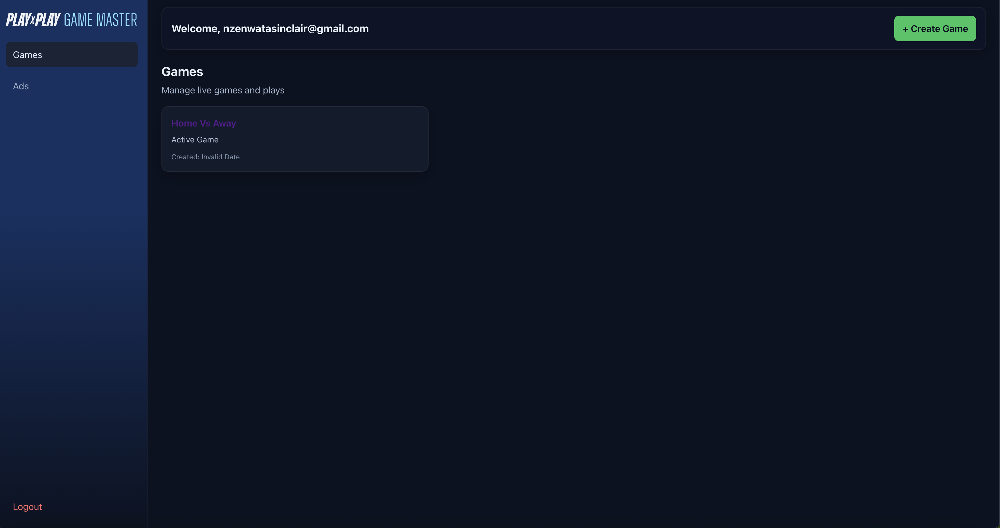
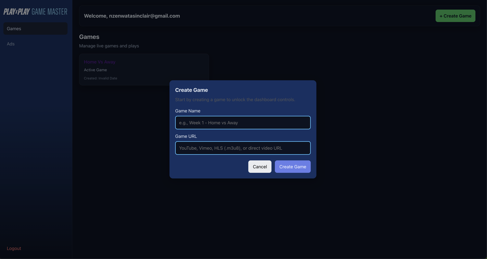
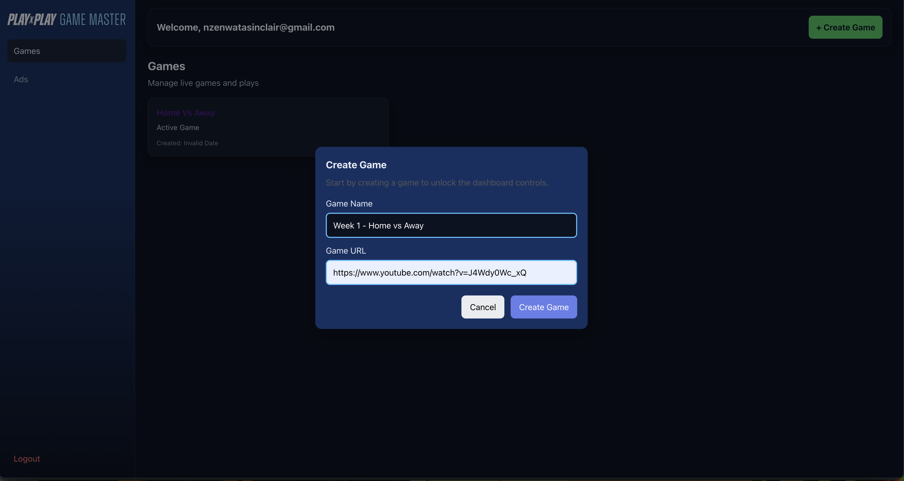
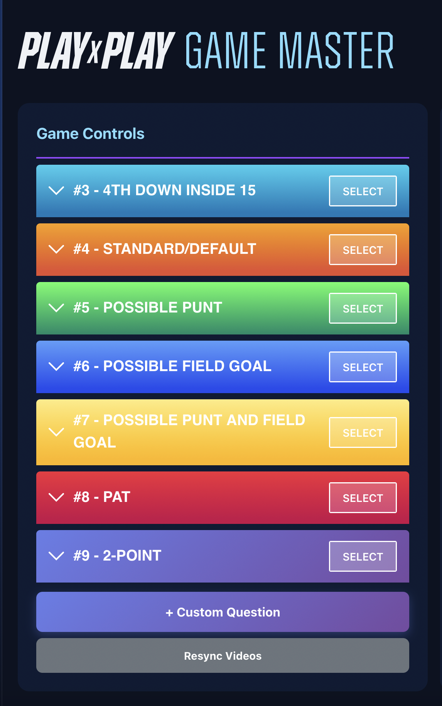
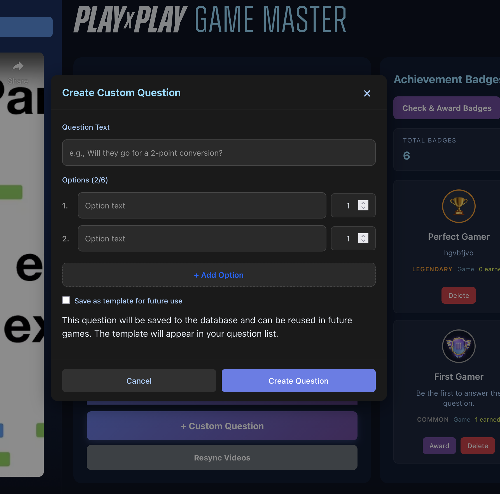
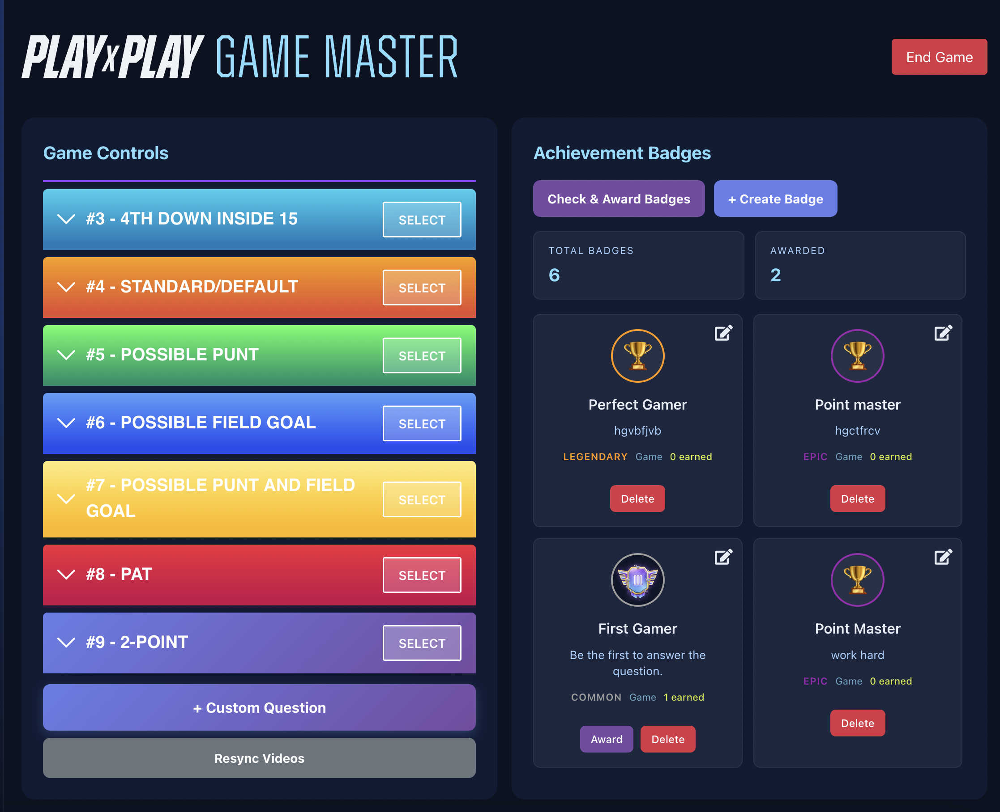
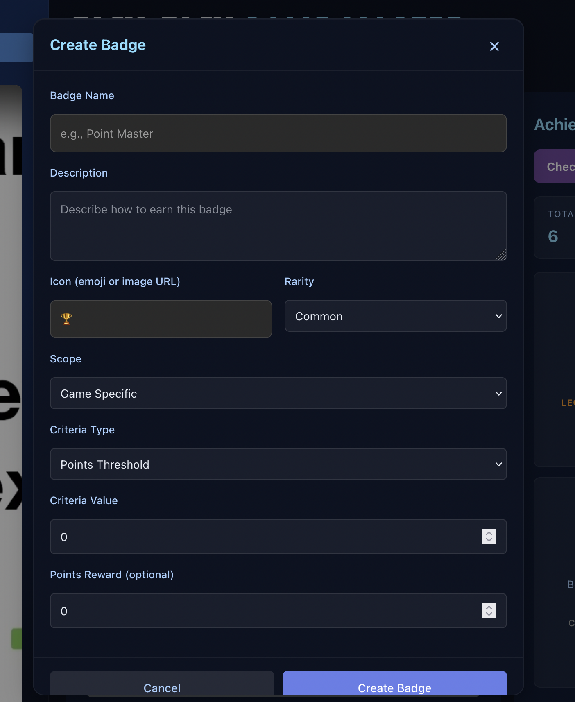
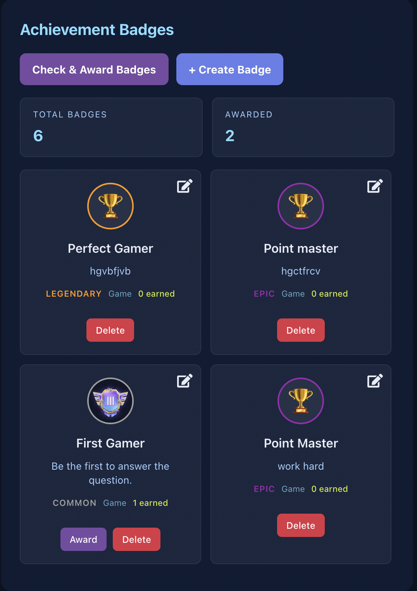
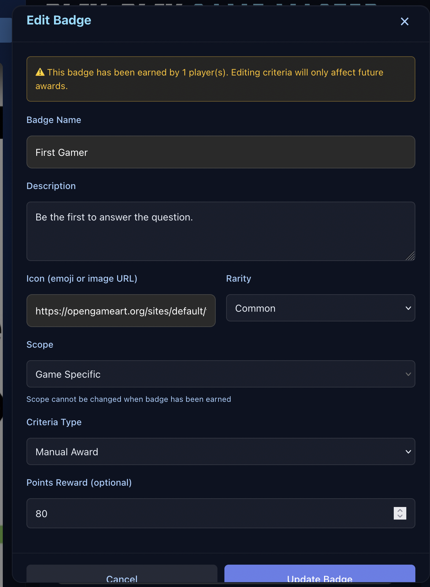

# Play by Play Admin - User Manual

## Table of Contents

1. [Getting Started](#getting-started)
2. [Logging In](#logging-in)
3. [Home Page Overview](#home-page-overview)
4. [Creating a Game](#creating-a-game)
5. [Dashboard Overview](#dashboard-overview)
6. [Game Controls](#game-controls)
7. [Achievement Badges](#achievement-badges)
8. [Keyboard Hotkeys](#keyboard-hotkeys)
9. [Ending a Game](#ending-a-game)
10. [FAQ](#faq)

---

## Getting Started

### System Requirements

Before using Play by Play Admin, ensure you have:

- **Web Browser**: Latest version of Chrome, Firefox, Safari, or Edge
- **Internet Connection**: Stable connection for real-time features
- **Device**: Desktop, tablet, or laptop (mobile not recommended for best experience)

### Accessing the Application

1. Open your web browser
2. Navigate to the application URL provided by your administrator
3. You should see the **Login Screen**

> **Note**: If you don't have login credentials, contact your administrator or the PxP team.

---

## Logging In

### Step 1: Enter Your Credentials

1. On the login screen, enter your **Email Address** in the first field
2. Enter your **Password** in the second field
3. Click the **"Sign In"** button

### Step 2: After Successful Login

- You will be automatically redirected to the **Home Page**
- Your email will appear in the top-right corner of the screen
- You are now ready to create and manage games

### Troubleshooting Login

| Issue                                                         | Solution                                  |
| ------------------------------------------------------------- | ----------------------------------------- |
| "Invalid credentials" error                                   | Check your email and password are correct |
| "Cannot connect to server"                                    | Check your internet connection            |
| Page keeps redirecting to login                               | Clear your browser cache and try again    |
| Access denied. Only administrators can access this dashboard. | You don't have admin access to the system |

---

## Home Page Overview

### Page Layout

The Home Page consists of three main sections:

#### Top Navigation Bar

- **Logo**: Click to return to home from any page
- **User Menu**: Displays your email and logout option
- **Logout Button**: Click to safely exit the application

#### Main Content Area

- **Welcome Message**: "Welcome, [Your Name]"
- **Create Game Button**: Large blue button labeled "+ Create Game"
- **Active Games Section**: Shows games you're currently running

#### Current Game Card

- **Game Name**: Name of your active game
- **Status**: Shows if the game is currently active
- **Quick Actions**: Options to view or manage the game

### Key Features on Home Page

| Feature                | Description                         |
| ---------------------- | ----------------------------------- |
| Create Game            | Start a new game session            |
| View Active Games      | See all games currently in progress |
| Quick Dashboard Access | Jump directly to game dashboard     |

---

## Creating a Game

### Step 1: Open Create Game Modal

1. On the Home Page, click the **"+ Create Game"** button
2. A modal dialog will appear

### Step 2: Fill in Game Details

The Create Game modal has two required fields:

#### Field 1: Game Name

- **Label**: "Game Name"
- **Instructions**: Enter a descriptive name for your game
- **Example**:
    - "Championship Final - Team A vs Team B"

#### Field 2: Game URL

- **Label**: "Game URL"
- **Supported Formats**:
    - YouTube links: `https://www.youtube.com/watch?v=...`
    - Vimeo links: `https://vimeo.com/...`
    - HLS streams: `.m3u8` file URLs
    - Direct video URLs: HTTP/HTTPS video file links

### Step 3: Create the Game

1. Review the information you entered
2. Click **"Create Game"** button to proceed
    - OR click **"Cancel"** to close the modal without creating

### Step 4: Confirmation

- You will be automatically redirected to the **Dashboard**
- The game is now active and ready for player participation

### Important Notes

- **Create Game Limitations**: Only one active game allowed at a time
- **Game URL**: Ensure the video URL is publicly accessible
- **Supported Formats**: If your video link doesn't work, verify it's in a supported format
- **Duration**: Games remain active until you manually end them

---

## Dashboard Overview

### Main Dashboard Layout

The Dashboard is divided into three main panels:

### Left Panel: App View

- **Video Player**: Shows the current game video

### Middle Panel: Game Controls

- **Play Templates**: Quick-access predefined plays
- **Answer Selection**: Choose correct answers for verification

### Right Panel: Message Controls

- **System Messages**: Game notifications and updates

### Top Navigation

- **Logo**: Return to home page
- **Logout**: Exit the dashboard
- **End Game Button**: Terminate the current game session

---

## Game Controls

### Understanding the Game Controls Panel

The Game Controls panel is where you manage all interactive elements of your game.

### Starting a play

#### Step 1: Select a play

1. Click on one of the play option buttons
2. The form will update based on your selection
3. It will highlight the selected option as being active
4. It will display a button to close the play if needed

#### Step 2: Close a play

1. When ready to reveal answers, click the **"Close Play Window"** button
2. The **"Close Play"** button will update to **"PLAY WINDOW CLOSED"**
3. The play will be closed, and you can select the answer to the play

#### Step 3: Select the answer

1. Click on one of the answer option buttons to select the correct answer
2. The selected answer will be highlighted
3. Click the **"Send Answers"** button to confirm your selection
4. The correct answer will be sent to all connected players
5. The play will be finally closed.

---

### Creating Custom Questions (On-the-Fly)

Custom questions allow you to create questions instantly during a game without using predefined templates. This is perfect for unexpected plays or situations that weren't anticipated.

#### Step 1: Open Custom Question Modal

1. In the Game Controls panel, locate the **"+ Custom Question"** button
2. Click the button to open the Custom Question creation modal

#### Step 2: Enter Question Details

The Custom Question modal contains the following fields:

**Question Text**

- Enter your question text (up to 200 characters)
- Example: "Will they go for a 2-point conversion?"

**Options**

- You can add 2 to 6 answer options
- For each option:
    - Enter the option text (up to 100 characters)
    - Set the points value (between 1 and 100)
- Click **"+ Add Option"** to add more options (up to 6 total)
- Click the **×** button to remove an option (minimum 2 required)

**Save as Template**

- Check the **"Save as template for future use"** checkbox if you want to reuse this question in future games
- If checked, the question will be saved to your question templates list
- If unchecked, the question will be used only for this game session

#### Step 3: Create the Question

1. Review all fields to ensure they are correct
2. Click **"Create Question"** to activate the question
    - OR click **"Cancel"** to close without creating

#### Step 4: Managing Custom Questions

Once created, custom questions work just like template questions:

1. The question appears in the Custom Question display area
2. Players can submit their predictions
3. When ready, close the play window (see [Step 2: Close a play](#step-2-close-a-play))
4. Select the correct answer(s) from the options
5. Click **"Send Answers"** to submit the results

### Important Notes for Custom Questions

- **Points Range**: Each option must have points between 1 and 100
- **Minimum Options**: At least 2 options are required
- **Maximum Options**: Up to 6 options can be added
- **Template Saving**: If you save as template, the question will appear in your question list with a number (e.g., "#10 - Will they go for a 2-point conversion?")
- **One-Time Use**: If not saved as template, the question is only available for the current game

---

## Achievement Badges

### Badge System Overview

The Achievement Badge system allows you to create, manage, and award badges to players based on their performance. Badges can be awarded automatically when players meet certain criteria, or manually by you as the game master.

### Creating a Badge

#### Step 1: Open Create Badge Modal

1. In the Badge Manager section, click the **"+ Create Badge"** button
2. The Create Badge modal will appear

#### Step 2: Fill in Badge Details

**Basic Information**

- **Badge Name**: Enter a descriptive name (e.g., "Point Master", "Sharp Shooter")
- **Description**: Explain what the badge represents and how to earn it
- **Icon**: Enter an emoji (e.g., 🏆, ⭐, 🎯) or an image URL
- **Rarity**: Select from:
    - **Common** (Gray) - Basic achievements
    - **Rare** (Blue) - Uncommon achievements
    - **Epic** (Purple) - Significant achievements
    - **Legendary** (Orange) - Exceptional achievements

**Badge Scope**

- **Game-Specific**: Badge is only available for the current game
- **Global**: Badge is available across all games

**Awarding Criteria**
Select how the badge is earned:

- **Points Threshold**: Awarded when a player reaches a certain point total
    - Enter the minimum points required (e.g., 100)
- **Accuracy Threshold**: Awarded when a player achieves a certain accuracy percentage
    - Enter the minimum accuracy percentage (e.g., 80)
    - Requires at least 1 prediction to be eligible
- **Participation Threshold**: Awarded when a player participates in a certain number of questions
    - Enter the minimum number of questions (e.g., 10)
- **Perfect Game**: Awarded when a player gets all predictions correct in a game
    - No additional value required
- **Manual**: Badge must be awarded manually by you
    - Use this for special recognition or custom achievements

**Points Reward** (Optional)

- Enter bonus points to award when the badge is earned (e.g., 50)

#### Step 3: Create the Badge

1. Review all information
2. Click **"Create Badge"** to save
    - OR click **"Cancel"** to close without creating

### Managing Badges

#### Viewing Badges

The Badge Manager displays all badges in a grid layout showing:

- Badge icon and name
- Description
- Rarity level (color-coded)
- Scope (game or global)
- Number of times the badge has been earned
- Action buttons (Edit, Award, Delete)

#### Editing a Badge

1. Click the **Edit** icon (pencil) on the badge card
2. Modify the badge details in the modal
3. Click **"Update Badge"** to save changes

> **Note**: You can only change the scope of a badge if it hasn't been earned yet.

#### Deleting a Badge

1. Click the **"Delete"** button on the badge card
2. Confirm the deletion in the dialog
3. The badge will be permanently removed

### Awarding Badges

#### Automatic Awarding

Badges with criteria (points, accuracy, participation, perfect game) are automatically checked and awarded when:

1. You click the **"Check & Award Badges"** button in the Badge Manager
2. The system checks all players against badge criteria
3. Players who meet the criteria automatically receive the badge
4. A success message confirms the check is complete

> **Tip**: It's recommended to check badges periodically during the game and especially before ending the game.

#### Manual Awarding

For badges with "Manual" criteria type:

1. Click the **"Award"** button on the badge card
2. Select a player from the dropdown list
3. Click **"Award Badge"** to assign the badge
4. The badge is immediately assigned to the selected player

### Badge Statistics

The Badge Manager displays:

- **Total Badges**: Number of badges created for this game
- **Awarded**: Total number of badge assignments (players who earned badges)

### Important Notes for Badges

- **Automatic Checking**: Badges are not checked automatically in real-time. Use "Check & Award Badges" to update awards.
- **Game-Specific vs Global**: Game-specific badges only apply to the current game. Global badges apply across all games.
- **Badge Rarity**: Rarity affects visual styling but doesn't impact functionality.
- **Points Rewards**: Bonus points from badges are added to the player's total score.
- **Multiple Badges**: Players can earn multiple badges in a single game.

---

## Keyboard Hotkeys

### Overview

Keyboard hotkeys allow you to quickly perform common actions without using the mouse. This can significantly speed up your workflow during active games.

### Available Hotkeys

#### Number Keys (1-9, 0)

**Function**: Select a question template from the list

**How to Use**:

- Press **1** through **9** to select the first through ninth question template
- Press **0** to select the tenth question template
- The question is immediately created and activated

**When Available**:

- Always available when viewing the Game Controls panel
- Works even when typing in form fields

**Example**:

- Press **3** to quickly activate the third question template in your list

#### Spacebar

**Function**: Close the active play window

**How to Use**:

- Press **Space** when a question is active (status: "Predictions OPEN")
- The play window will close, allowing you to select answers

**When Available**:

- Only works when there is an active question with status "active"
- Prevents default scrolling behavior

**Example**:

- After players have submitted predictions, press **Space** to close the question window

#### Enter Key

**Function**: Send selected answers

**How to Use**:

- Select one or more answer options
- Press **Enter** to submit the selected answers
- Answers are sent to all players immediately

**When Available**:

- Only works when you have selected at least one answer
- Works in form fields and throughout the interface

**Example**:

- After closing a question and selecting the correct answer, press **Enter** instead of clicking "Send Answers"

### Hotkey Reference Table

| Hotkey    | Action                             | When Available            |
| --------- | ---------------------------------- | ------------------------- |
| **1-9**   | Select question template (1st-9th) | Always                    |
| **0**     | Select question template (10th)    | Always                    |
| **Space** | Close play window                  | When question is active   |
| **Enter** | Send selected answers              | When answers are selected |

---

## Ending a Game

### Before You End the Game

Ensure you have:

- ✓ Asked all planned questions
- ✓ Announced final results
- ✓ Rewarded top players
- ✓ Checked and awarded achievement badges (click "Check & Award Badges" in Badge Manager)

### Step 1: Click End Game Button

1. In the top navigation bar, click **"End Game"** button
2. A confirmation dialog will appear

### Step 2: Confirm Game Termination

The dialog will show:

- Game name: "[Game Name] will be ended"
- Warning: "This action cannot be undone"
- Confirmation buttons: **"Cancel"** or **"Confirm"**

> **Warning**: Ending a game cannot be reversed. All active questions will be closed.

### Step 3: Game Ended

After confirmation:

- You are redirected to the Home Page

---

## FAQ

### General Questions

**Q: Can I use Play by Play Admin on mobile devices?**  
A: While the application may be accessible on mobile, it's optimized for desktop/laptop use. A tablet may work well for testing purposes.

### Game Management

**Q: How long can a game session last?**  
A: As long as you need. Games can run for hours. Just remember to click "End Game" when finished.

**Q: What happens if I accidentally close the browser during a game?**  
A: Log back in immediately. Your game should still be active, and you can resume. Player data is preserved.

**Q: Can I have multiple games running simultaneously?**  
A: No, you can only have one active game at a time as an admin. You must end the current game before starting a new one.

**Q: Can I create questions that aren't in the template list?**  
A: Yes! Use the "+ Custom Question" button to create questions on-the-fly. You can optionally save them as templates for future use.

**Q: How do badges get awarded to players?**  
A: Badges with automatic criteria (points, accuracy, participation, perfect game) are awarded when you click "Check & Award Badges". Manual badges must be awarded by clicking the "Award" button on the badge.

**Q: Can I use keyboard shortcuts to speed up my workflow?**  
A: Yes! Press number keys (1-9, 0) to select questions, Space to close play windows, and Enter to send answers. See the [Keyboard Hotkeys](#keyboard-hotkeys) section for details.

**Q: What's the difference between game-specific and global badges?**  
A: Game-specific badges only apply to the current game. Global badges are available across all games and can be earned by players in any game session.

---

## Document Information

**Last Updated**: December 2025  
**Version**: 2.0  
**For**: Play by Play Admin Users
