# Play by Play Admin - User Manual

## Table of Contents

1. [Getting Started](#getting-started)
2. [Logging In](#logging-in)
3. [Registering a New Account](#registering-a-new-account)
4. [Home Page Overview](#home-page-overview)
5. [Creating a Game](#creating-a-game)
6. [Managing Scheduled Games](#managing-scheduled-games)
7. [Dashboard Overview](#dashboard-overview)
8. [Game Controls](#game-controls)
9. [Messaging](#messaging)
10. [AI assistant](#ai-assistant)
11. [Achievement Badges](#achievement-badges)
12. [Template Builder](#template-builder)
13. [Probability Manager](#probability-manager)
14. [Legends Manager](#legends-manager)
15. [Players Lookup](#players-lookup)
16. [Game History](#game-history)
17. [Custom Hotkeys](#custom-hotkeys)
18. [Audit Logs](#audit-logs)
19. [Keyboard Hotkeys](#keyboard-hotkeys)
20. [Theme Toggle](#theme-toggle)
21. [Draft system](#draft-system)
22. [AppView emulation](#appview-emulation)
23. [Live dashboard: game notes checklist](#live-dashboard-game-notes-checklist)
24. [Game History: search & filter](#game-history-search--filter)
25. [Question reordering](#question-reordering)
26. [Hotkey combinations](#hotkey-combinations)
27. [CSV / JSON export](#csv--json-export)
28. [Ending a Game](#ending-a-game)
29. [FAQ](#faq)

## Getting Started

### System Requirements

Before using Play by Play Admin, ensure you have:

- **Web Browser**: Latest version of Chrome, Firefox, Safari, or Edge
- **Internet Connection**: Stable connection for real-time features
- **Device**: Desktop, tablet, or laptop (mobile not recommended for best experience)

### Accessing the Application

1. Open your web browser
2. Navigate to the application URL provided by your administrator
3. You should see the **Login Screen**

> **Note**: If you don't have login credentials, contact your administrator or the PxP team.

---

## Logging In

### Step 1: Enter Your Credentials

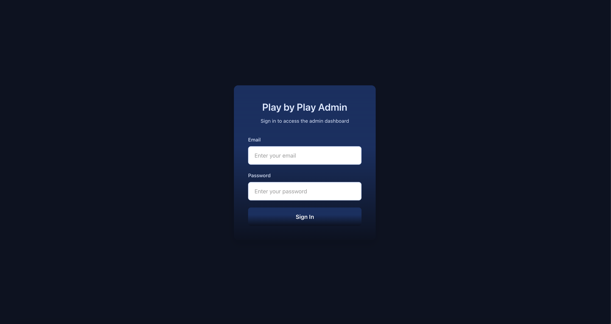

1. On the login screen, enter your **Email Address** in the first field
2. Enter your **Password** in the second field
3. Click the **"Sign In"** button

### Step 2: After Successful Login

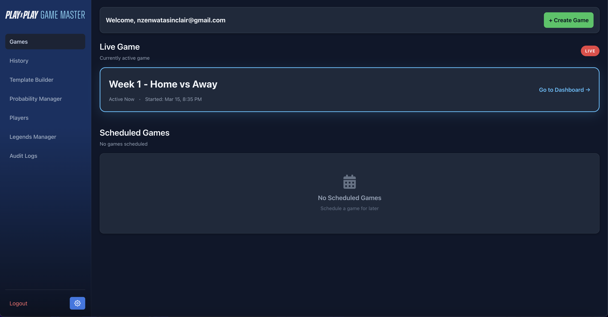

- You will be automatically redirected to the **Home Page**
- Your email will appear in the top-right corner of the screen
- You are now ready to create and manage games

### Troubleshooting Login

| Issue                                                         | Solution                                  |
| ------------------------------------------------------------- | ----------------------------------------- |
| "Invalid credentials" error                                   | Check your email and password are correct |
| "Cannot connect to server"                                    | Check your internet connection            |
| Page keeps redirecting to login                               | Clear your browser cache and try again    |
| Access denied. Only administrators can access this dashboard. | You don't have admin access to the system |

---

## Registering a New Account

### Overview

If you don't have an account yet, you can register for a new admin account directly from the login page.

### Step 1: Access Registration Page

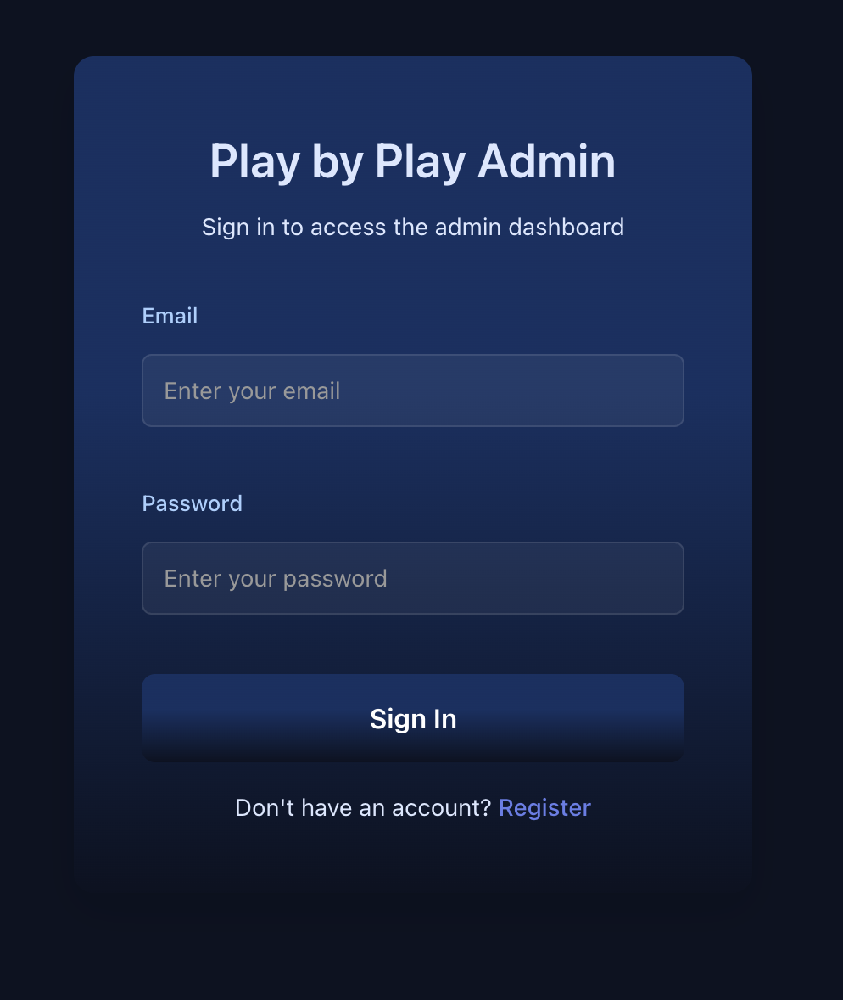

1. On the login screen, click the **"Register"** or **"Create Account"** link
2. You will be redirected to the registration page

### Step 2: Fill in Registration Details

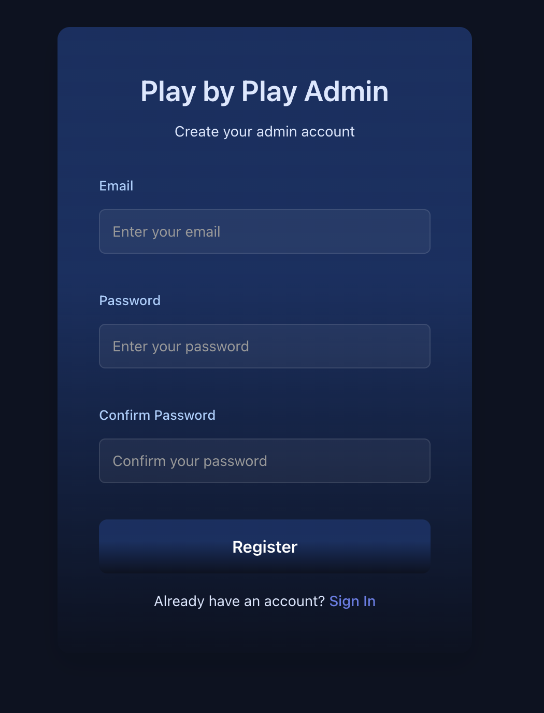

The registration form requires the following information:

#### Field 1: Email Address

- **Label**: "Email"
- **Instructions**: Enter a valid email address
- **Requirements**: Must be a valid email format
- **Note**: This email will be used for login and account recovery

#### Field 2: Password

- **Label**: "Password"
- **Instructions**: Create a secure password
- **Requirements**:
    - Must meet Firebase authentication requirements
    - Should be at least 6 characters (Firebase minimum)
    - Use a combination of letters, numbers, and special characters for better security

#### Field 3: Confirm Password

- **Label**: "Confirm Password"
- **Instructions**: Re-enter your password to confirm
- **Requirements**: Must match the password entered above

### Step 3: Submit Registration

1. Review all information to ensure it's correct
2. Click the **"Register"** button
3. If successful, you will be redirected to the login page
4. Log in with your new credentials

### After Registration

- Your account is immediately active
- You can log in using your email and password
- You have full admin access to create and manage games

### Troubleshooting Registration

| Issue                        | Solution                                            |
| ---------------------------- | --------------------------------------------------- |
| "Email already in use"       | This email is already registered. Use login instead |
| "Passwords do not match"     | Ensure both password fields are identical           |
| "Password too weak"          | Use a stronger password (6+ characters)             |
| "Invalid email format"       | Check that your email address is valid              |
| Registration button disabled | Ensure all fields are filled correctly              |

---

## Home Page Overview

### Page Layout

The Home Page consists of three main sections:

#### Top Navigation Bar

- **Logo**: Click to return to home from any page
- **User Menu**: Displays your email and logout option
- **Logout Button**: Click to safely exit the application

#### Main Content Area

- **Welcome Message**: "Welcome, [Your Name]"
- **Create Game Button**: Large blue button labeled "+ Create Game"
- **Active Games Section**: Shows games you're currently running

#### Current Game Card

- **Game Name**: Name of your active game
- **Status**: Shows if the game is currently active
- **Quick Actions**: Options to view or manage the game

#### Scheduled Games Section

- **Scheduled Games List**: Shows all games scheduled for future dates
- **Game Cards**: Each scheduled game displays:
    - Game name
    - Scheduled date and time
    - Action buttons (Edit, Delete, Start Game Now)
- **Empty State**: Shows when no games are scheduled

#### Draft Games Section (New)

- **Draft games** are incomplete games saved to finish later.
- Drafts appear alongside your other game lists on the Home page.

### Key Features on Home Page

| Feature                | Description                            |
| ---------------------- | -------------------------------------- |
| Create Game            | Start a new game session               |
| Schedule Game          | Create a game for a future date/time   |
| View Active Games      | See all games currently in progress    |
| Manage Scheduled Games | Edit, start, or delete scheduled games |
| Quick Dashboard Access | Jump directly to game dashboard        |
| Draft Games            | Save incomplete games and edit later   |

---

## Creating a Game

### Step 1: Open Create Game Modal

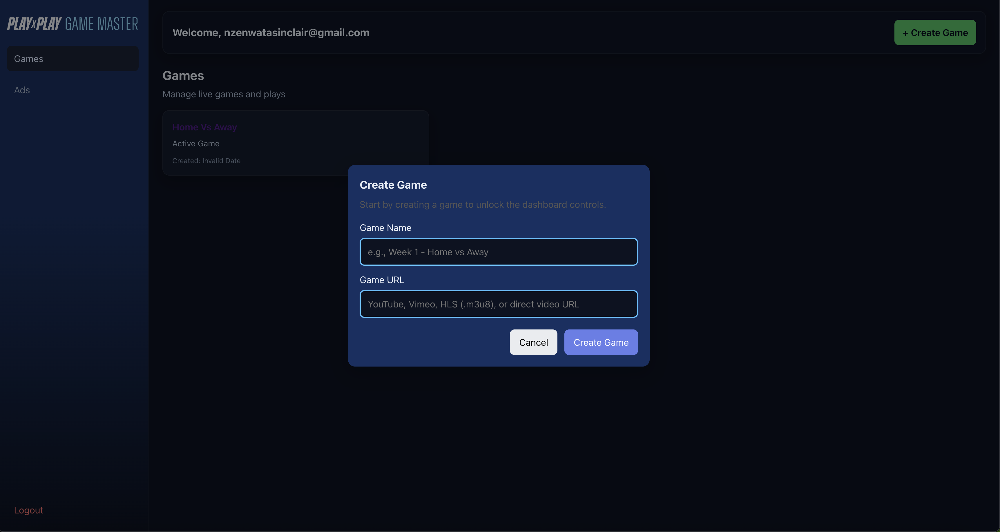

1. On the Home Page, click the **"+ Create Game"** button
2. A modal dialog will appear

### Step 2: Fill in Game Details

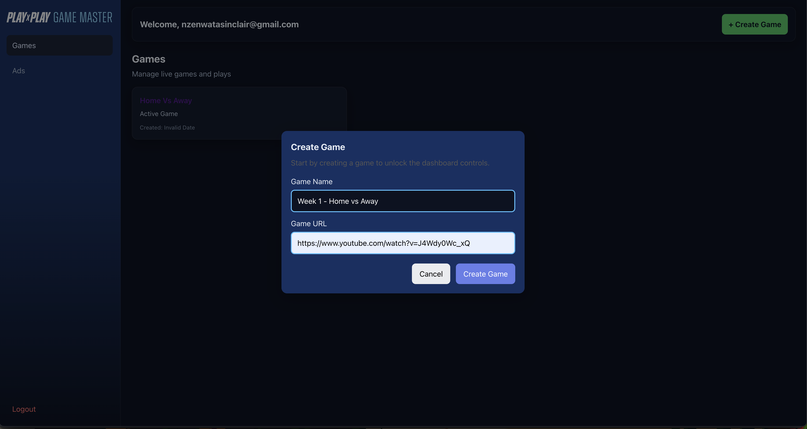

The Create Game modal has the following fields:

#### Field 1: Game Name (Required)

- **Label**: "Game Name"
- **Instructions**: Enter a descriptive name for your game
- **Example**:
    - "Championship Final - Team A vs Team B"

#### Field 2: Game URL (Required)

- **Label**: "Game URL"
- **Supported Formats**:
    - YouTube links: `https://www.youtube.com/watch?v=...`
    - Vimeo links: `https://vimeo.com/...`
    - HLS streams: `.m3u8` file URLs
    - Direct video URLs: HTTP/HTTPS video file links

#### Field 3: Second Game URL (Optional)

- **Label**: "Second Game URL"
- **Instructions**: Enter an additional video URL if needed
- **Supported Formats**: Same as Game URL

#### Field 4: Template Set (Optional)

- **Label**: "Template Set"
- **Instructions**: Select a question set to pre-populate questions for this game
- **Options**:
    - "None" - Start with no preloaded questions
    - Any set you've created in Template Builder
- **Note**: Selecting a template set will make those questions available in the Game Controls panel

#### Field 5: Schedule for Later (Optional)

- **Label**: "Schedule for later" (Checkbox)
- **Instructions**: Check this box to schedule the game for a future date and time
- **When Checked**: Additional fields appear:
    - **Scheduled Date**: Select a future date
    - **Scheduled Time**: Select a time
- **Requirements**:
    - Scheduled time must be in the future
    - Both date and time are required when scheduling

### Step 3: Create or Schedule the Game

1. Review all information you entered
2. Click the appropriate button:
    - **"Create Game"** - Start the game immediately
    - **"Schedule Game"** - Save the game for later (if scheduled)
    - **"Cancel"** - Close the modal without creating

### Step 4: Confirmation

#### For Immediate Games

- You will be automatically redirected to the **Dashboard**
- The game is now active and ready for player participation

#### For Scheduled Games

- A success message will appear: "Game scheduled successfully!"
- The game appears in the **Scheduled Games** section on the Home Page
- The game will remain scheduled until you start it

### Saving a Game as a Draft (New)

Drafts let you save an incomplete game and come back later.

**How to use drafts**

1. Open **+ Create Game**
2. Fill in any information you have available
3. Click **Save Draft** (button name may vary slightly depending on UI)

**What happens next**

- The game appears under **Drafts** on the Home page
- You can open the draft later, edit it, and finish creating/scheduling it

### Important Notes

- **Create Game Limitations**: Only one active game allowed at a time
- **Game URL**: Ensure the video URL is publicly accessible
- **Supported Formats**: If your video link doesn't work, verify it's in a supported format
- **Duration**: Games remain active until you manually end them
- **Scheduled Games**: Can be edited, started, or deleted before they begin
- **Scheduling**: Scheduled games do not start automatically - you must manually start them when ready

---

## Managing Scheduled Games

### Overview

Scheduled games allow you to prepare games in advance and start them at a specific date and time. This is useful for planning events, ensuring all details are set up before the game begins.

### Viewing Scheduled Games

1. On the Home Page, scroll to the **"Scheduled Games"** section
2. All your scheduled games are displayed as cards
3. Each card shows:
    - Game name
    - Scheduled date and time
    - Action buttons

### Starting a Scheduled Game

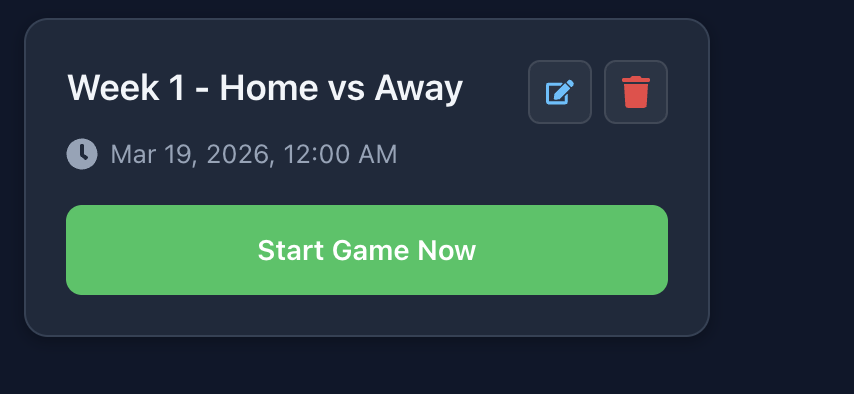

1. Find the scheduled game you want to start
2. Click the **"Start Game Now"** button on the game card
3. The game will immediately become active
4. You will be redirected to the **Dashboard**

> **Note**: You can start a scheduled game at any time, even before the scheduled date/time.

### Editing a Scheduled Game

1. Find the scheduled game you want to edit
2. Click the **Edit** icon (pencil) button on the game card
3. The Create Game modal will open with the game's current details
4. Modify any fields:
    - Game name
    - Game URL
    - Second Game URL
    - Template Set
    - Scheduled date and time
5. Click **"Update Game"** to save changes
    - OR click **"Cancel"** to discard changes

> **Note**: You cannot change a scheduled game to an immediate game, or vice versa, after creation.

### Deleting a Scheduled Game

1. Find the scheduled game you want to delete
2. Click the **Delete** icon (trash) button on the game card
3. Confirm the deletion in the dialog
4. The game will be permanently removed

> **Warning**: Deleting a scheduled game cannot be undone. All game details will be lost.

### Important Notes for Scheduled Games

- **No Auto-Start**: Scheduled games do not start automatically. You must manually start them.
- **Editing Limitations**: You can edit scheduled games, but cannot change them to immediate games.
- **Start Anytime**: You can start a scheduled game before its scheduled time if needed.
- **One Active Game**: Starting a scheduled game will make it your active game (you can only have one active game at a time).
- **Template Sets**: Scheduled games can use template sets, which will be available when you start the game.

---

## Dashboard Overview

### Main Dashboard Layout

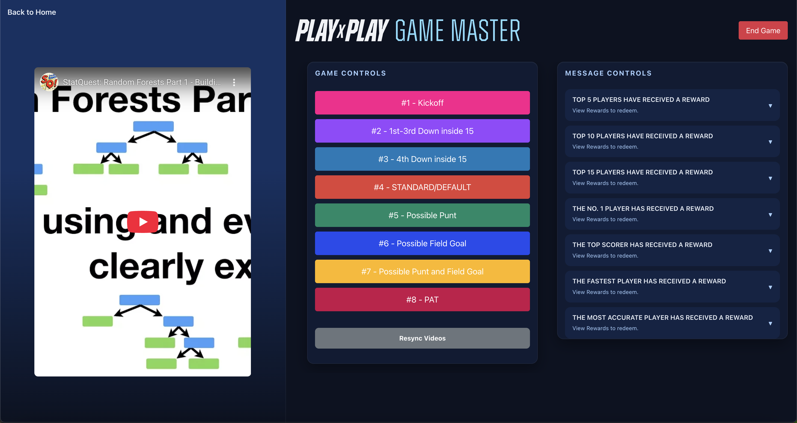

The Dashboard is divided into three main panels:

### Left Panel: App View

- **Video Player**: Shows the current game video
- **Player experience emulation (New)**: App View more closely mirrors the mobile gameplay experience so operators can preview what players are seeing.

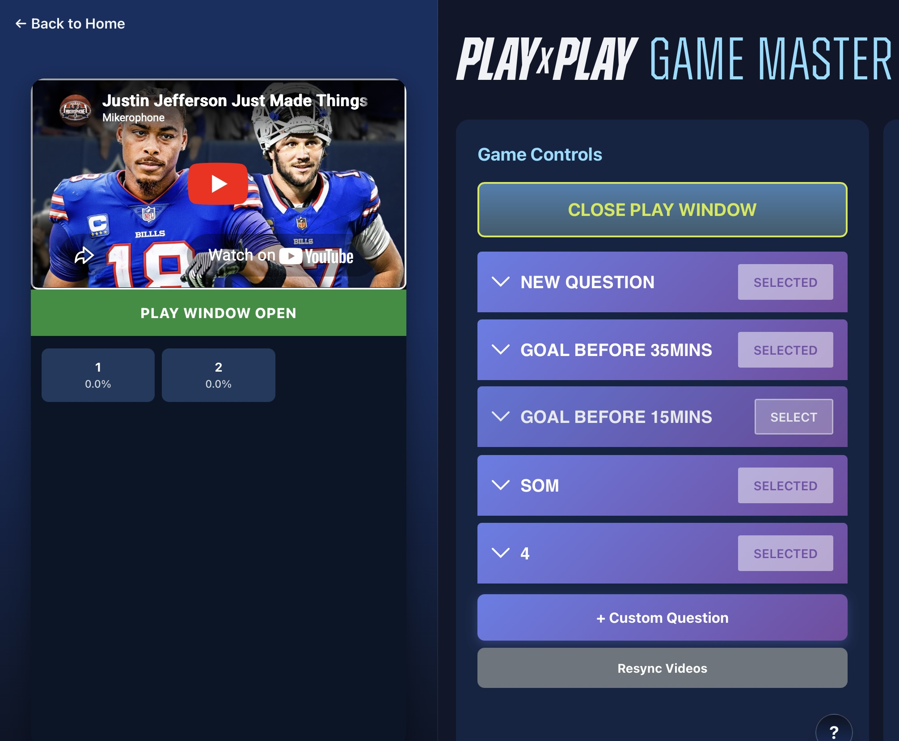

### Middle Panel: Game Controls

- **Play Templates**: Quick-access predefined plays
- **Answer Selection**: Choose correct answers for verification

### Right Panel: Message Controls

- **Message Controls (modal)**: Open the in-game message feed and send admin broadcasts.
- **Pinned message banner**: Pin one message to keep it highlighted for players/admins.
- **Moderation**: Delete inappropriate or outdated messages (soft delete).

### Top Navigation

- **Logo**: Return to home page
- **Logout**: Exit the dashboard
- **End Game Button**: Terminate the current game session

### Game Notes Checklist (New)

The dashboard includes a lightweight notes checklist to track tasks during a live game without leaving the dashboard.

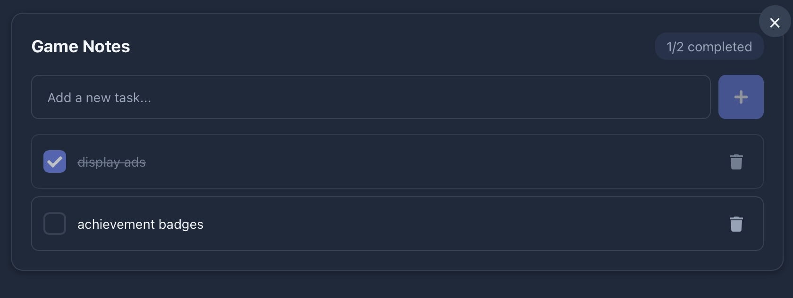

**How it works**

- Click the **Notes** button in the dashboard header (next to the message button) to open a modal
- Add checklist items, check/uncheck, delete items
- Double-click a task to edit text
- Press **Escape** to close the modal

---

## Game Controls

### Understanding the Game Controls Panel

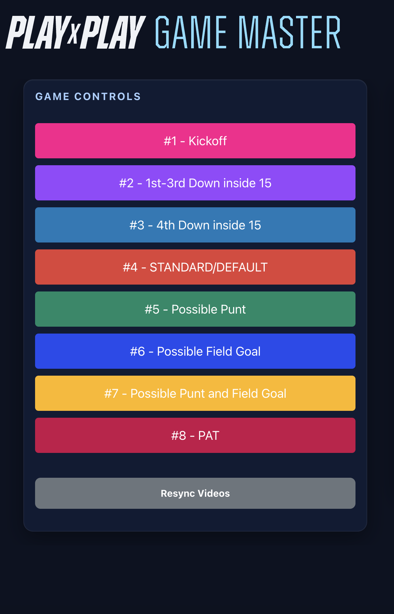

The Game Controls panel is where you manage all interactive elements of your game.

### Starting a play

#### Step 1: Select a play

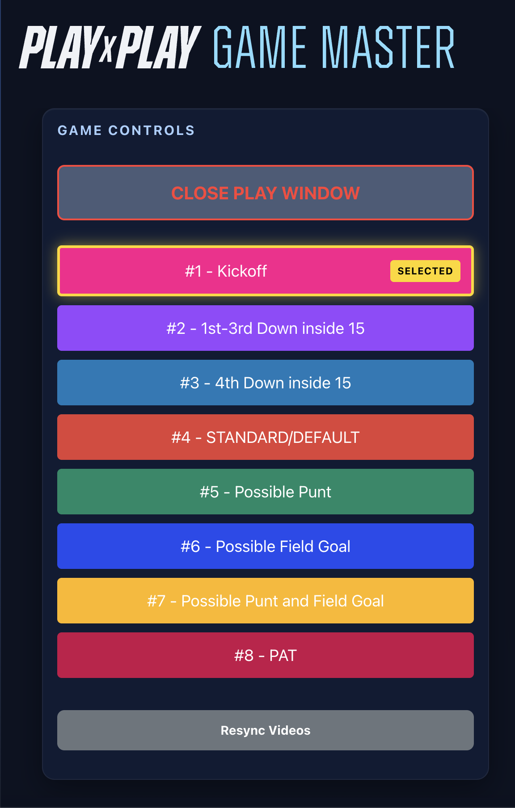

1. Click on one of the play option buttons
2. The form will update based on your selection
3. It will highlight the selected option as being active
4. It will display a button to close the play if needed

#### Step 2: Close a play

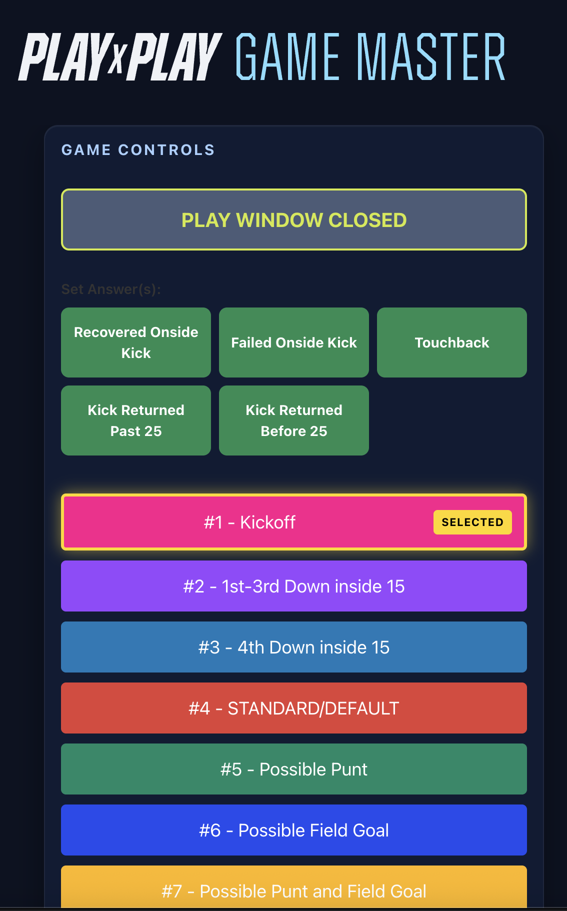

1. When ready to reveal answers, click the **"Close Play Window"** button
2. The **"Close Play"** button will update to **"PLAY WINDOW CLOSED"**
3. The play will be closed, and you can select the answer to the play

#### Step 3: Select the answer

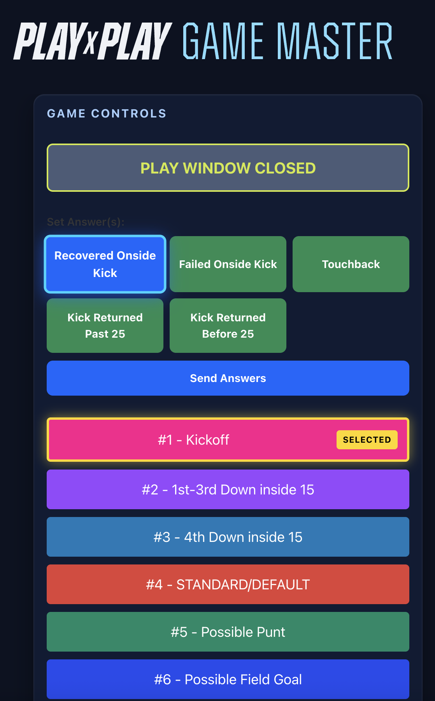

1. Click on one of the answer option buttons to select the correct answer
2. The selected answer will be highlighted
3. Click the **"Send Answers"** button to confirm your selection
4. The correct answer will be sent to all connected players
5. The play will be finally closed.

---

### Creating Custom Questions (On-the-Fly)

Custom questions allow you to create questions instantly during a game without using predefined templates. This is perfect for unexpected plays or situations that weren't anticipated.

#### Step 1: Open Custom Question Modal

1. In the Game Controls panel, locate the **"+ Custom Question"** button
2. Click the button to open the Custom Question creation modal

#### Step 2: Enter Question Details

The Custom Question modal contains the following fields:

**Question Text**

- Enter your question text (up to 200 characters)
- Example: "Will they go for a 2-point conversion?"

**Options**

- You can add 2 to 6 answer options
- For each option:
    - Enter the option text (up to 100 characters)
    - Set the points value (between 1 and 100)
- Click **"+ Add Option"** to add more options (up to 6 total)
- Click the **×** button to remove an option (minimum 2 required)

**Save as Template**

- Check the **"Save as template for future use"** checkbox if you want to reuse this question in future games
- If checked, the question will be saved to your question templates list
- If unchecked, the question will be used only for this game session

#### Step 3: Create the Question

1. Review all fields to ensure they are correct
2. Click **"Create Question"** to activate the question
    - OR click **"Cancel"** to close without creating

#### Step 4: Managing Custom Questions

Once created, custom questions work just like template questions:

1. The question appears in the Custom Question display area
2. Players can submit their predictions
3. When ready, close the play window (see [Step 2: Close a play](#step-2-close-a-play))
4. Select the correct answer(s) from the options
5. Click **"Send Answers"** to submit the results

### Important Notes for Custom Questions

- **Points Range**: Each option must have points between 1 and 100
- **Minimum Options**: At least 2 options are required
- **Maximum Options**: Up to 6 options can be added
- **Template Saving**: If you save as template, the question will appear in your question list with a number (e.g., "#10 - Will they go for a 2-point conversion?")
- **One-Time Use**: If not saved as template, the question is only available for the current game

---

## Messaging

### Message Controls Panel Overview

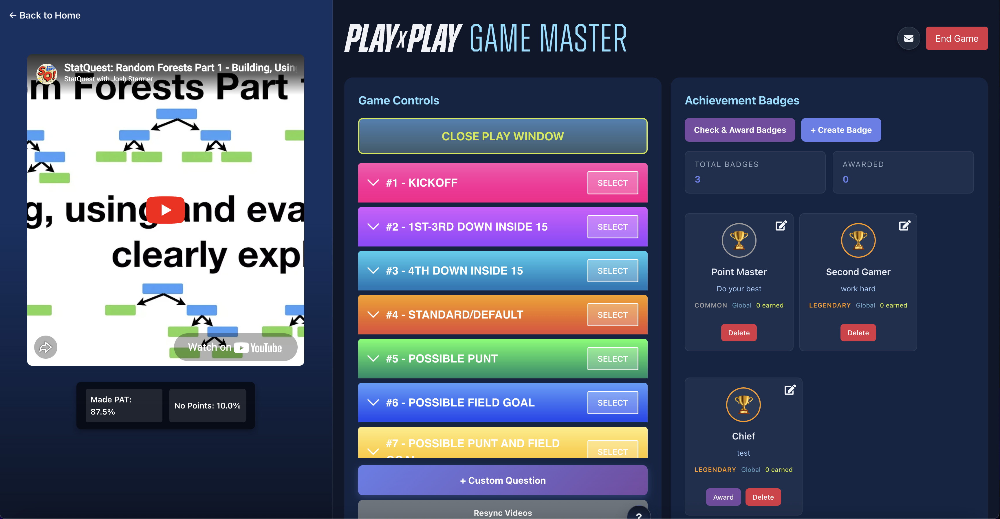

The Message Controls panel lets you manage in-game messages for the current game:

- **Broadcast** an admin message to all players
- **Pin/Unpin** a message (one pinned message at a time)
- **Delete** messages (soft delete)

> **Note**: Message actions are recorded in **Audit Logs** (e.g., broadcast, pinned/unpinned, deleted).

### Opening Message Controls

1. Start or open an active game and go to the **Dashboard**
2. In the top-right of the Dashboard, click the **envelope** icon
3. A modal opens with the message feed and composer

### Sending a Broadcast

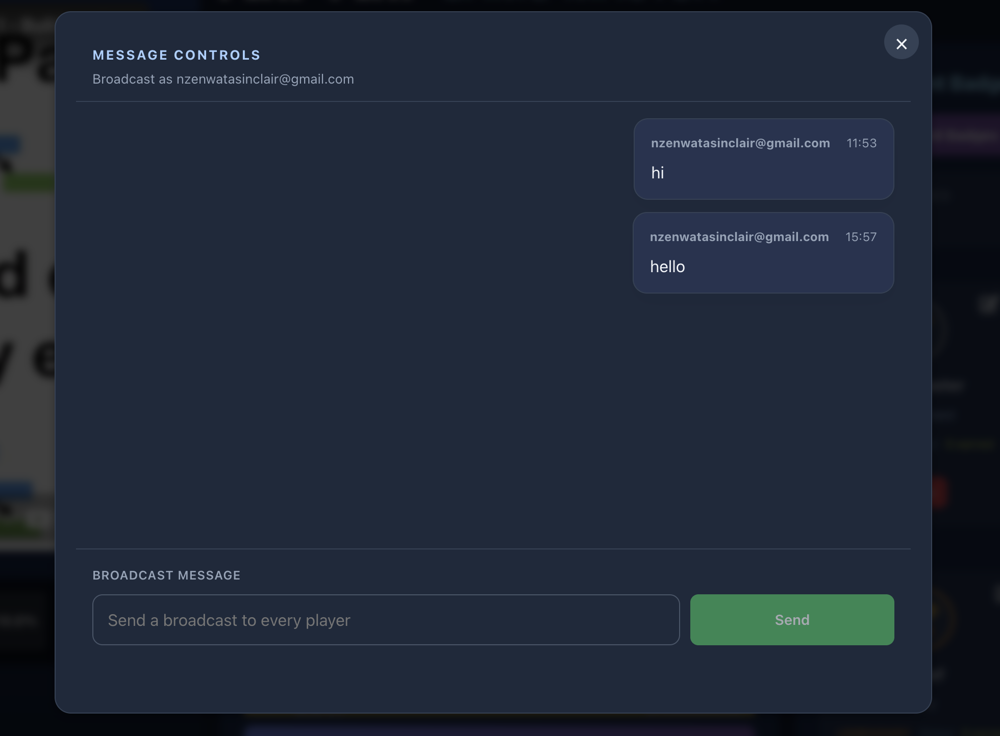

1. Type your message in **Broadcast message**
2. Press **Send** (or press **Enter**)

**Rules**

- **Max length**: 500 characters
- **Empty messages**: Not allowed

### Pinning / Unpinning a Message

1. Find a message in the feed
2. Click the **pin** (📌) button to pin it
3. Click the pin again to unpin

**Pinned banner**

- When a message is pinned, it appears in a **Pinned message** banner at the top
- Pinning a different message automatically unpins the previous one

### Deleting a Message

1. Find a message in the feed
2. Click the **trash** (🗑) button

> **Note**: Deleted messages are removed from the feed (soft deleted in the database).

### Closing the Modal

You can close Message Controls by:

- Clicking outside the modal (the dark backdrop)
- Pressing **Escape**
- Clicking the **×** close button

---

## AI assistant

### Overview

The AI assistant is an optional in-app chat assistant intended to help operators during admin workflows.

### Using the AI Assistant

1. Open the AI assistant panel in the UI
2. Type your question or request
3. Review the assistant’s response and apply it to your workflow as needed

### Notes

- Availability depends on environment configuration (it may be disabled in some deployments).

## Achievement Badges

### Badge System Overview

The Achievement Badge system allows you to create, manage, and award badges to players based on their performance. Badges can be awarded automatically when players meet certain criteria, or manually by you as the game master.

### Creating a Badge

#### Step 1: Open Create Badge Modal

1. In the Badge Manager section, click the **"+ Create Badge"** button
2. The Create Badge modal will appear

#### Step 2: Fill in Badge Details

**Basic Information**

- **Badge Name**: Enter a descriptive name (e.g., "Point Master", "Sharp Shooter")
- **Description**: Explain what the badge represents and how to earn it
- **Icon**: Enter an emoji (e.g., 🏆, ⭐, 🎯) or an image URL
- **Rarity**: Select from:
    - **Common** (Gray) - Basic achievements
    - **Rare** (Blue) - Uncommon achievements
    - **Epic** (Purple) - Significant achievements
    - **Legendary** (Orange) - Exceptional achievements

**Badge Scope**

- **Game-Specific**: Badge is only available for the current game
- **Global**: Badge is available across all games

**Awarding Criteria**
Select how the badge is earned:

- **Points Threshold**: Awarded when a player reaches a certain point total
    - Enter the minimum points required (e.g., 100)
- **Accuracy Threshold**: Awarded when a player achieves a certain accuracy percentage
    - Enter the minimum accuracy percentage (e.g., 80)
    - Requires at least 1 prediction to be eligible
- **Participation Threshold**: Awarded when a player participates in a certain number of questions
    - Enter the minimum number of questions (e.g., 10)
- **Perfect Game**: Awarded when a player gets all predictions correct in a game
    - No additional value required
- **Manual**: Badge must be awarded manually by you
    - Use this for special recognition or custom achievements

**Points Reward** (Optional)

- Enter bonus points to award when the badge is earned (e.g., 50)

#### Step 3: Create the Badge

1. Review all information
2. Click **"Create Badge"** to save
    - OR click **"Cancel"** to close without creating

### Managing Badges

#### Viewing Badges

The Badge Manager displays all badges in a grid layout showing:

- Badge icon and name
- Description
- Rarity level (color-coded)
- Scope (game or global)
- Number of times the badge has been earned
- Action buttons (Edit, Award, Delete)

#### Editing a Badge

1. Click the **Edit** icon (pencil) on the badge card
2. Modify the badge details in the modal
3. Click **"Update Badge"** to save changes

> **Note**: You can only change the scope of a badge if it hasn't been earned yet.

#### Deleting a Badge

1. Click the **"Delete"** button on the badge card
2. Confirm the deletion in the dialog
3. The badge will be permanently removed

### Awarding Badges

#### Automatic Awarding

Badges with criteria (points, accuracy, participation, perfect game) are automatically checked and awarded when:

1. You click the **"Check & Award Badges"** button in the Badge Manager
2. The system checks all players against badge criteria
3. Players who meet the criteria automatically receive the badge
4. A success message confirms the check is complete

> **Tip**: It's recommended to check badges periodically during the game and especially before ending the game.

#### Manual Awarding

For badges with "Manual" criteria type:

1. Click the **"Award"** button on the badge card
2. Select a player from the dropdown list
3. Click **"Award Badge"** to assign the badge
4. The badge is immediately assigned to the selected player

### Badge Statistics

The Badge Manager displays:

- **Total Badges**: Number of badges created for this game
- **Awarded**: Total number of badge assignments (players who earned badges)

### Important Notes for Badges

- **Automatic Checking**: Badges are not checked automatically in real-time. Use "Check & Award Badges" to update awards.
- **Game-Specific vs Global**: Game-specific badges only apply to the current game. Global badges apply across all games.
- **Badge Rarity**: Rarity affects visual styling but doesn't impact functionality.
- **Points Rewards**: Bonus points from badges are added to the player's total score.
- **Multiple Badges**: Players can earn multiple badges in a single game.

---

## Template Builder

### Overview

The Template Builder allows you to create and manage question sets (templates) that can be reused across multiple games. This feature helps you organize your questions into logical groups and makes it easier to prepare questions before a game starts.

### Accessing Template Builder

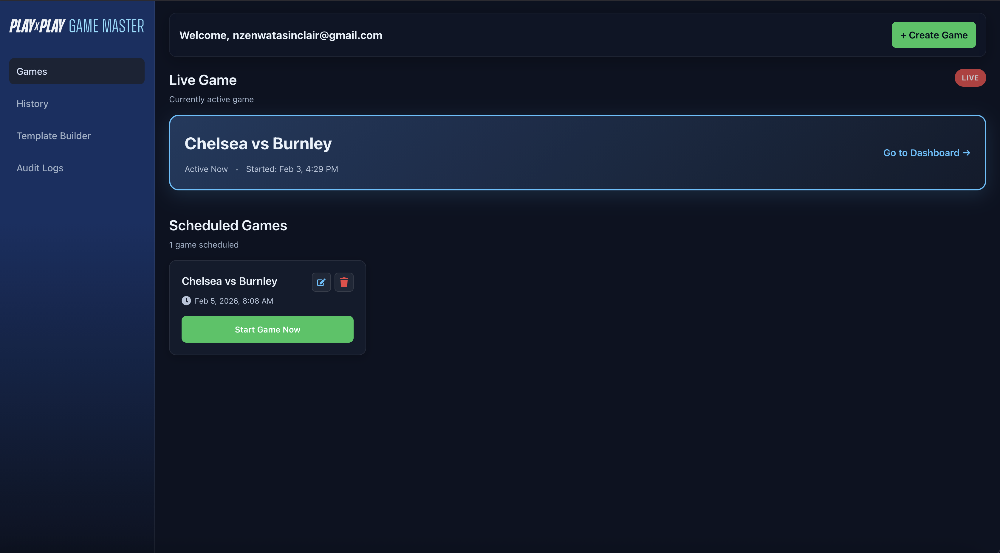

1. From the Home Page, click **"Template Builder"** in the left sidebar
2. You will see the Template Builder page with all your question sets

### Template Builder Page Layout

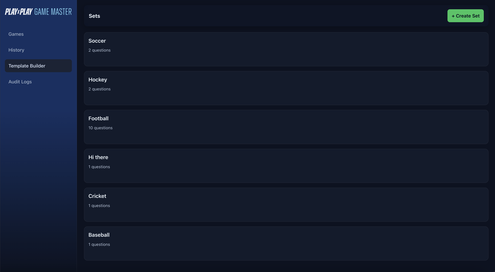

The Template Builder page displays:

- **Header**: "Sets" title and "+ Create Set" button
- **Sets Grid**: All your question sets displayed as cards
- **Set Cards**: Each card shows:
    - Set name
    - Number of questions in the set

### Creating a New Set

#### Step 1: Open Create Set Modal

1. Click the **"+ Create Set"** button in the header
2. A modal dialog will appear

#### Step 2: Enter Set Name

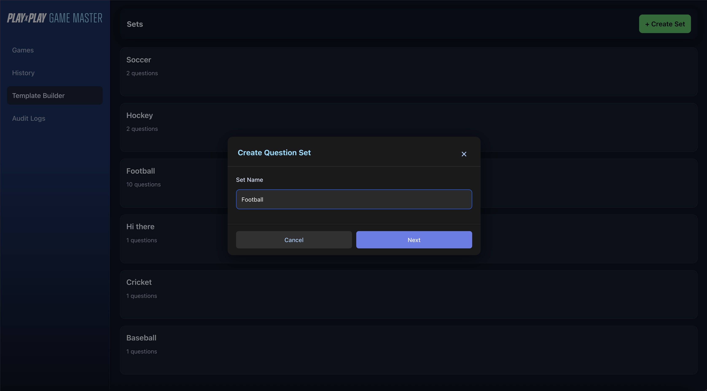

1. Enter a descriptive name for your set (e.g., "Football", "Basketball", "Baseball")
2. Set names must be:
    - Between 1 and 50 characters
    - Unique (cannot duplicate existing set names)
3. Click **"Next"** to proceed

#### Step 3: Create First Question

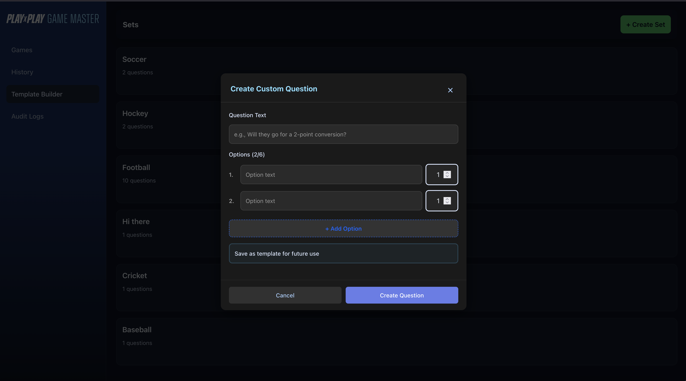

1. Enter the question text (up to 200 characters)
2. Add 2-6 answer options:
    - Enter option text (up to 100 characters)
    - Set points value (1-100)
    - Click **"+ Add Option"** to add more options
    - Click **×** to remove an option
3. Click **"Create Set"** to save

> **Note**: The first question is automatically added to the new set. You can add more questions later from the Set Dashboard.

### Managing Sets

#### Viewing a Set

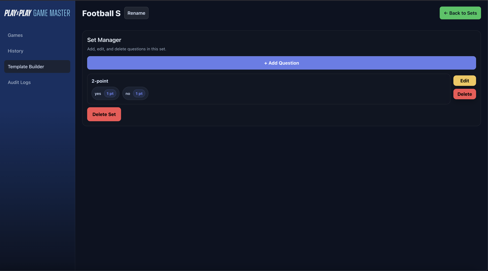

1. Click on any set card to open the Set Dashboard
2. You will see all questions in that set

#### Renaming a Set

1. Open the Set Dashboard for the set you want to rename
2. Click the **"Rename"** button next to the set name
3. Enter the new name (1-50 characters)
4. Click **"Save"** to confirm
    - OR click **"Cancel"** to discard changes

> **Warning**: Renaming a set updates all questions in that set. This action affects all games using questions from this set.

#### Deleting a Set

1. Open the Set Dashboard for the set you want to delete
2. Scroll to the bottom of the page
3. Click the **"Delete Set"** button
4. Confirm the deletion in the dialog

> **Warning**: Deleting a set will:
> - Remove the set from all questions that belong to it
> - Delete questions that belong ONLY to this set
> - This action cannot be undone

#### Adding Questions to a Set

1. In the Set Dashboard, scroll to the question list
2. Click **"+ Add Question"** button
3. Fill in the question details:
    - Question text
    - Answer options (2-6 options)
    - Points for each option
4. Click **"Create Question"** to save

#### Editing Questions

1. Find the question you want to edit in the list
2. Click the **"Edit"** button on the question card
3. Modify the question text or options
4. Click **"Update Question"** to save changes

#### Reordering Questions (New)

Questions in a set/template can be reordered using arrow controls.

1. In the set dashboard, find the question you want to move
2. Click the **Up** or **Down** arrow on the question card
3. The list updates to match the new order

> **Note**: Games using the template should respect this ordering when showing questions in Game Controls.

#### Deleting Questions

1. Find the question you want to delete
2. Click the **"Delete"** button on the question card
3. Confirm the deletion in the dialog

> **Note**: Deleting a question removes it from the set and all future games. It does not affect questions already used in past games.

---

## Probability Manager

### Overview

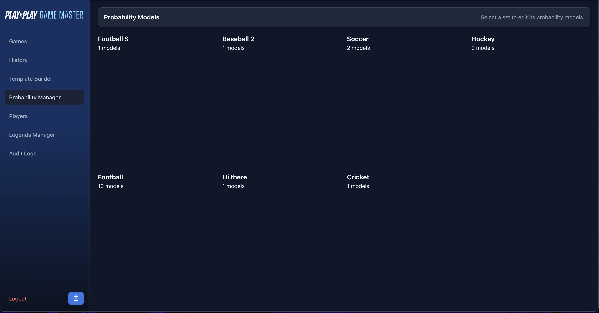

The Probability Manager allows you to establish and manage predicted outcome probabilities for questions across your template sets. This feature helps track and adjust probability models for various scenarios based on historical data or expert analysis.

### Accessing Probability Manager

1. From the Home Page, click **"Probability Manager"** in the left sidebar
2. You will see the Probability Manager page with all your question sets

### Probability Manager Page Layout

The Probability Manager displays:

- **Header**: "Probability Models" title and description
- **Sets Grid**: All your question sets displayed as cards
- **Set Cards**: Each card shows:
    - Set name
    - Number of probability models in the set

### Managing Probability Models for a Set

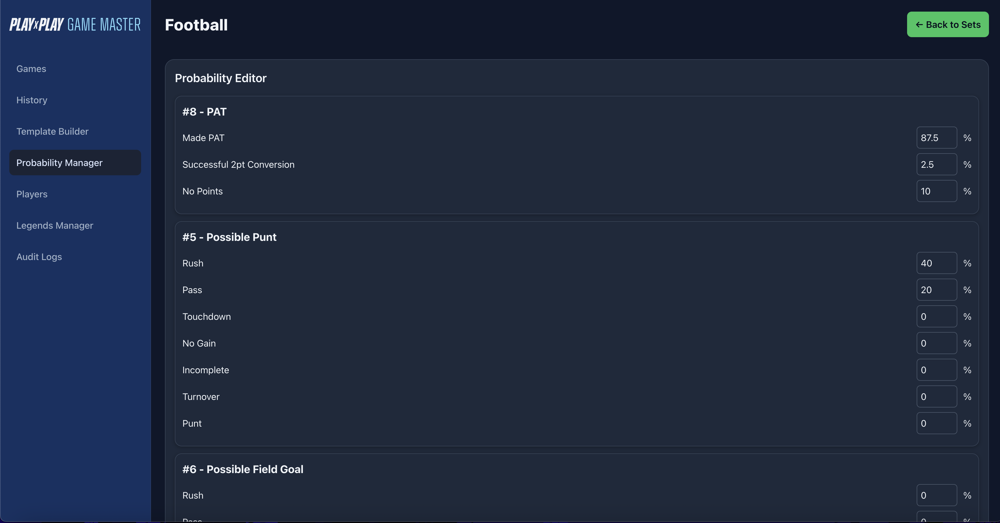

#### Step 1: Select a Set

1. On the Probability Manager page, click on a set card
2. You will be taken to the **Probability Set Dashboard**

#### Step 2: View Questions in the Set

The Probability Set Dashboard displays:

- **Set Name**: At the top of the page
- **Questions List**: All questions in the selected set
- **Probability Fields**: For each question, you can enter predicted outcome probabilities

#### Step 3: Edit Probabilities

For each question:

1. Enter the probability percentage for each answer option
2. Probabilities should represent a predicted likelihood of each outcome
3. You can enter percentages (0-100) for each option
4. Click **"Save"** to save probability adjustments

#### Step 4: Return to Probability Manager

1. Click the **"Back"** button to return to the main Probability Manager page
2. Your probability model changes are saved

### Important Notes for Probability Manager

- The probabilities you enter are being displayed in the game page for each question template
- 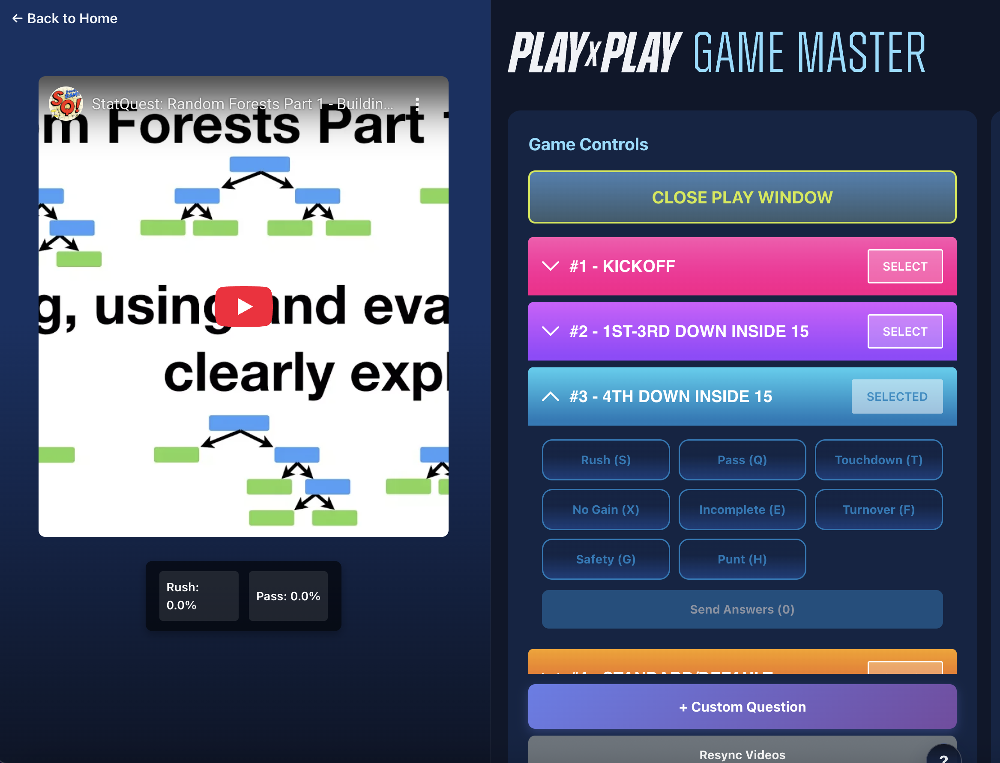

---

## Legends Manager

### Overview

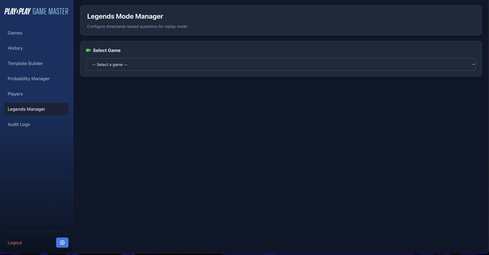

The Legends Manager allows you to convert ended games into "Legend" status games and add detailed timemarks to questions. This feature is useful for creating archived game recordings with timestamped questions for future reference and replay.

### Accessing Legends Manager

1. From the Home Page, click **"Legends Manager"** in the left sidebar
2. You will see the Legends Manager page with all ended and legend games

### Legends Manager Page Layout

The Legends Manager displays:

- **Header**: "Legends Manager" title
- **Games List**: All your ended games and previously created legends
- **Game Cards**: Each card shows:
    - Game name
    - Status (Ended or Legend)
    - Quick action buttons

### Converting a Game to Legend Status

#### Step 1: Select an Ended Game

1. On the Legends Manager page, find the game you want to convert
2. Click the game card to select it
3. The game's questions will load automatically

#### Step 2: Add Timemarks to Questions

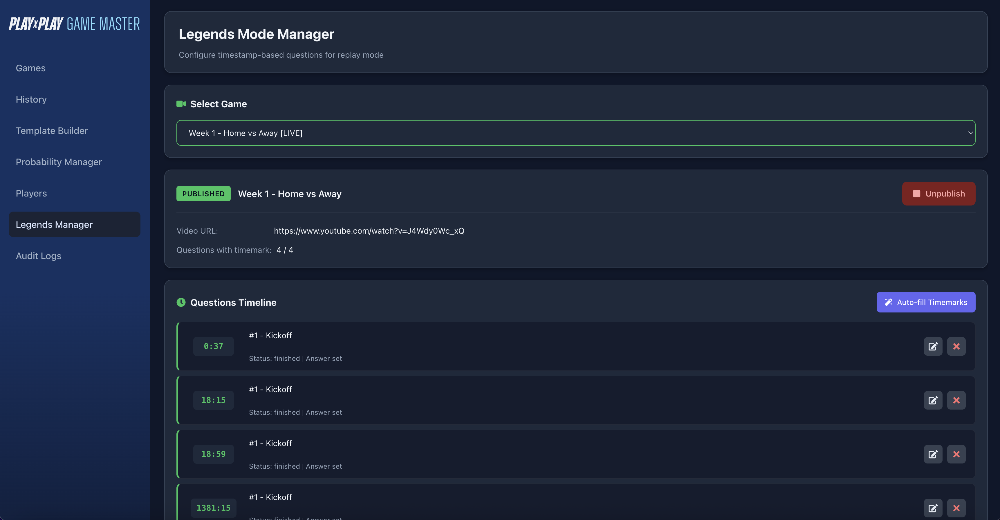

For each question in the game:

1. Click the **Edit** button (pencil icon) next to the question
2. Enter the **Timemark** - the timestamp in the video where this question occurs
3. Format: MM:SS (minutes:seconds) or HH:MM:SS (hours:minutes:seconds)
4. Click **"Save"** to save the timemark

#### Step 3: Save Game Configuration

1. After adding timemarks, click the **"Save"** button to save all changes
2. A success message will confirm your changes are saved

#### Step 4: Publish as Legend

1. Click the **"Publish as Legend"** button to finalize the legend game
2. The game status will change to "Legend"
3. The game is now archived and timestamped for future reference

### Legend Game Features

**Timestamped Questions**: Each question in a legend game includes:
- The timemark where it appears in the video
- Original question and answer data
- Player response information

**Easy Retrieval**: Legend games can be quickly accessed and their timemarks used to jump to specific moments in the video

**Historical Record**: Maintains a complete record of the game with video synchronization

### Important Notes for Legends Manager

- **Ended Games Only**: Only games with "Ended" status can be converted to Legend status
- **Timemarks Required**: You should add timemarks to at least the key questions for best results
- **Immutable After Publishing**: After publishing as Legend, timemarks cannot be edited (must edit before publishing)
- **Video Synchronization**: Timemarks allow easy navigation to specific questions in the video
- **Archive Purpose**: Legend games serve as permanent archives of your game sessions

---

## Players Lookup

### Overview

The Players Lookup feature allows you to search for individual players, view their statistics, and access detailed player profiles across all games. This is useful for player research, tracking performance trends, and awarding recognition.

### Accessing Players Lookup

1. From the Home Page, click **"Players"** in the left sidebar
2. You will see the Players Lookup page

### Players Lookup Page Layout

The Players Lookup page displays:

- **Search Section**: Search bar to find players by email or username
- **Top Players Section**: Leaderboard of the top 10 players by score
- **Player Profile Section**: Detailed information about a selected player

### Searching for a Player

#### Step 1: Enter Search Query

1. In the **Search** field, enter:
    - A player's **email address**, OR
    - A player's **username**
2. Click the **"Search"** button (or press Enter)

#### Step 2: View Search Results

If a player is found:

- The player card will display with basic information
- Click **"View Profile"** to see detailed statistics

If no player is found:

- You'll see a "No player found" message
- Try a different email or username

### Viewing Player Profile

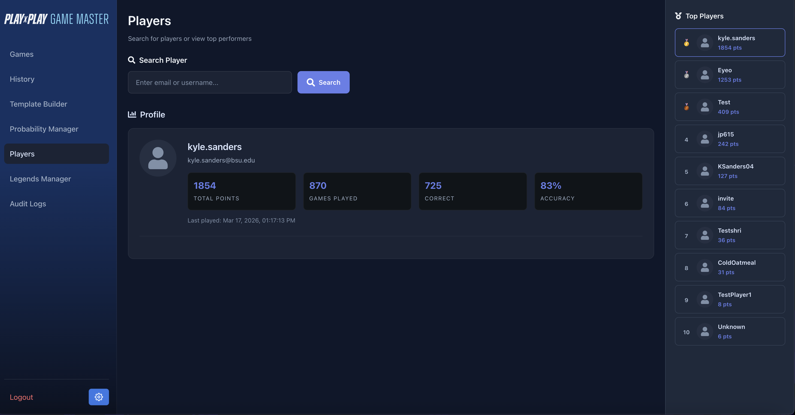

#### Profile Information Displayed

Once you click "View Profile", the player profile section shows:

- **Player Name/Email**: Player identification
- **Account Status**: Active/Inactive status
- **Total Points**: Cumulative points earned across all games
- **Games Played**: Number of games participated in
- **Accuracy Rate**: Percentage of correct predictions
- **Average Points Per Game**: Average score per game session
- **Badges Earned**: All badges awarded to the player
- **Achievement List**: Specific achievements and milestones
- **Recent Games**: List of recently participated games with scores

### Top Players Leaderboard

The **Top 10 Players** section shows:

- **Player Rank**: Numbered ranking (1-10)
- **Player Name/Email**: Player identification
- **Total Score**: Combined points across all games
- **Games Played**: Number of games participated in
- **Accuracy**: Overall prediction accuracy percentage

Click on any player in the top players list to view their detailed profile.

---

## Game History

### Overview

The Game History page allows you to view all your past games, see game statistics, and access detailed information about completed game sessions.

### Accessing Game History

1. From the Home Page, click **"History"** in the left sidebar
2. You will see the Game History page with all your ended games

### Game History Page Layout

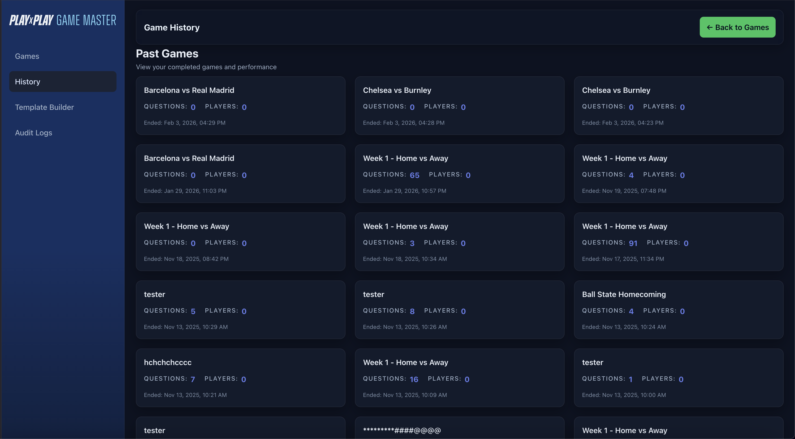

The Game History page displays:

- **Header**: "Game History" title
- **Games List**: All your ended games displayed in a table or list format
- **Game Information**: Each game shows:
    - Game name
    - Date ended
    - Number of questions asked
    - Number of players
    - Status (ended)

### Searching and Filtering (New)

Game History supports client-side filtering (no additional reads).

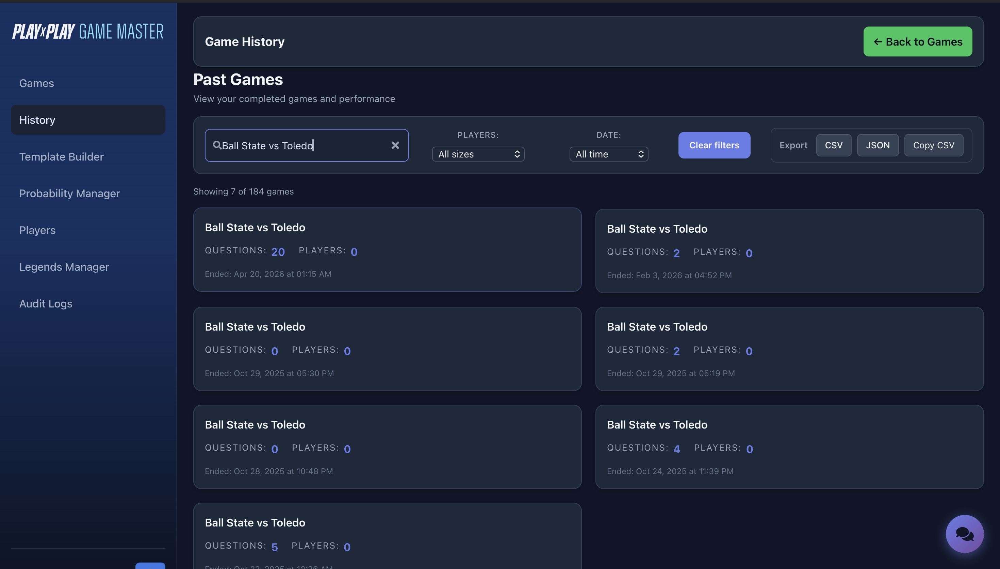

- **Search by name**: Find games by game name
- **Filter by player count**: small / medium / large
- **Filter by date**: today / week / month
- **Clear filters**: resets the list and results count

### Exporting CSV / JSON (New)

You can export Game History results for analysis.

**Available exports**

- Download **CSV**
- Download **JSON**
- Copy CSV (if available)

**Export behavior**

- Exports respect the same filters/search currently applied on screen

### Viewing Game Details

1. Click on any game in the history list
2. You will be taken to the Game Detail page

### Game Detail Page

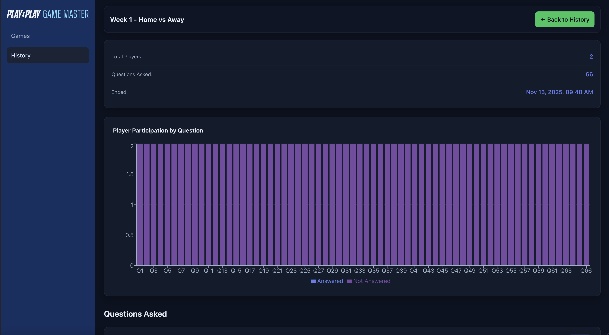

The Game Detail page shows comprehensive information about a specific game:

- **Game Information**:
    - Game name
    - Creation date
    - End date
    - Duration
    - Status
- **Statistics**:
    - Total questions asked
    - Total players
    - Player participation rates
- **Questions List**: All questions asked during the game
- **Player Activity**: Overview of player engagement
---

## Custom Hotkeys

### Overview

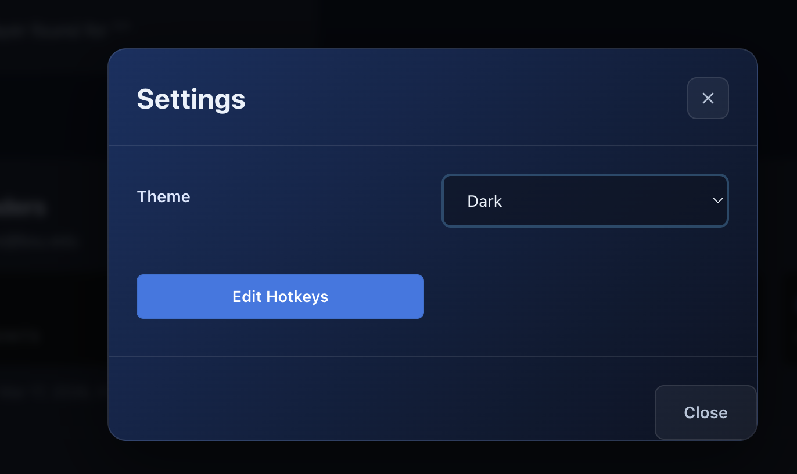
The Custom Hotkeys feature allows you to personalize keyboard shortcuts used during gameplay. You can customize all hotkeys to match your preferences, including template selection keys, answer selection keys, and action keys like closing play windows and sending answers.

### Accessing Custom Hotkeys

1. From the Home Page, click on the settings gear icon in the left sidebar
2. Click the **"Edit Hotkeys"** button to open the Custom Hotkeys page

### Custom Hotkeys Page Layout

The Custom Hotkeys page displays:

- **Header**: "Custom Hotkeys" title
- **Hotkeys Configuration Section**: All customizable hotkeys organized by category
- **Reset Button**: Restore all hotkeys to default settings

### Categories of Customizable Hotkeys

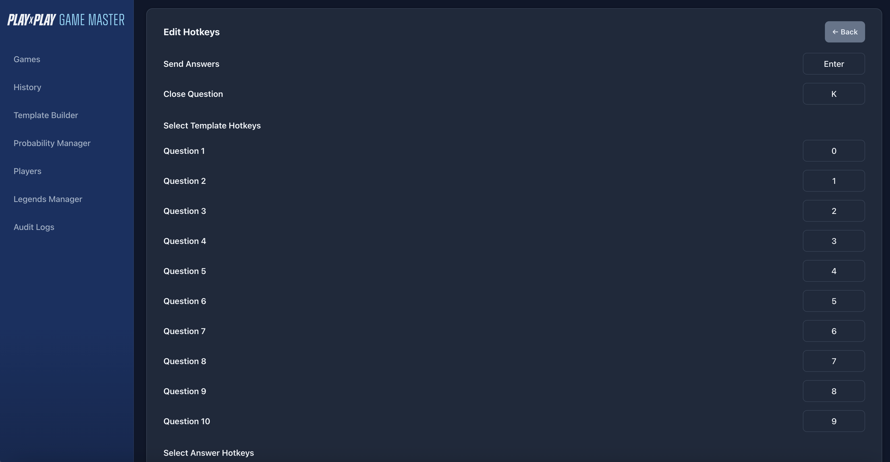

#### 1. Template Selection Hotkeys

**Purpose**: Quickly select and activate question templates (1-10)

**Default Keys**:
- **1-9**: Select questions 1-9
- **0**: Select question 10

**Customization**:
1. Click the edit button next to any template number
2. Press the key you want to assign to that template
3. The key is immediately recorded
4. Repeat for other template numbers

**Example**:
- Change template 1 from "1" to "a"
- Now pressing "a" will activate the first template

#### 2. Answer Selection Hotkeys

**Purpose**: Quickly select answer options (A, B, C, D, E, F)

**Default Keys**:
- **a**: Select answer option A
- **b**: Select answer option B
- **c**: Select answer option C
- **d**: Select answer option D
- **e**: Select answer option E
- **f**: Select answer option F

**Customization**:
1. Click the edit button next to any answer option
2. Press the key you want to assign to that answer
3. The key is immediately recorded
4. Repeat for other answer options

**Example**:
- Change answer A from "a" to "1"
- Now pressing "1" will select the first answer option

#### 3. Action Hotkeys

**Purpose**: Perform common game control actions

**Available Actions**:

- **Close Play Window**: Close the active question window
    - Default: **Space**
    - Customization: Click edit and press your preferred key

- **Send Answers**: Submit selected answers to all players
    - Default: **Enter**
    - Customization: Click edit and press your preferred key

### Configuring Custom Hotkeys

#### Step 1: Open Custom Hotkeys

1. Navigate to the Custom Hotkeys page from the Home Page sidebar

#### Step 2: Edit a Hotkey

1. Find the hotkey you want to customize
2. Click the **Edit** button (pencil icon) next to it
3. The field will be active and ready for input
4. Press any single key on your keyboard
5. The key is automatically saved

#### Step 3: Verify Your Changes

1. The new key will immediately appear in the hotkey field
2. Check for any **Duplicate Hotkey Warnings** at the top of the page
3. If duplicates exist, you'll see a warning message

#### Step 4: Reset to Defaults (Optional)

1. If you want to restore all hotkeys to default, click the **"Reset to Default"** button
2. Confirm the action in the dialog
3. All hotkeys will be reverted to their original settings

### Duplicate Hotkey Handling

The Custom Hotkeys system checks for conflicts:

**Duplicate Detection**:
- If you assign a key that's already in use, a warning appears
- Example: If both template 1 and answer A use "a", a warning shows

**Resolution**:
1. Review conflicting hotkeys shown in the warning
2. Edit one of the conflicting hotkeys to a different key
3. The warning will disappear when conflicts are resolved

### Local Storage Persistence

Custom hotkeys are saved automatically:

- Stored in your browser's local storage
- Persist across browser sessions
- Specific to your device (not synced to cloud)

**Reset Local Storage**:
1. Clear your browser cache and cookies to reset hotkeys
2. Or use the "Reset to Default" button on the Custom Hotkeys page

### Important Notes for Custom Hotkeys

- **Combination hotkeys supported (New)**: Hotkeys can use combinations (example: `Shift + 1`), depending on your configured mappings.
- **Case Insensitive**: Letter keys work in uppercase or lowercase (a = A)
- **Special Keys Supported**: Space, Enter, and other special keys are supported
- **No Duplication**: Assign each key to only one action
- **Immediate Effect**: Changes take effect immediately during gameplay
- **Device-Specific**: Hotkeys are saved per device/browser
- **Performance**: Using hotkeys can significantly speed up your workflow during games

---

## Audit Logs

### Overview

The Audit Logs feature provides a comprehensive audit trail of all administrative actions performed in the system. This helps track changes, maintain accountability, and troubleshoot issues.

### Accessing Audit Logs

1. From the Home Page, click **"Audit Logs"** in the left sidebar
2. You will see the Audit Logs page with all administrative actions

### Audit Logs Page Layout

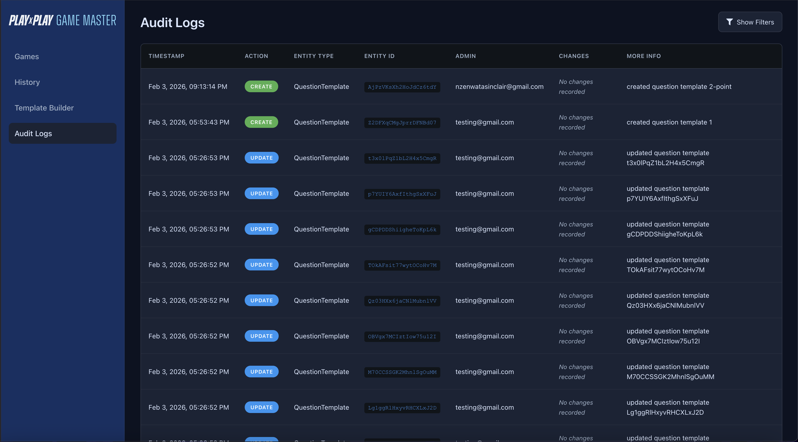

The Audit Logs page displays:

- **Header**: "Audit Logs" title and filter toggle button
- **Filters Section**: (Expandable) Filter options for actions, entity types, and admins
- **Audit Logs Table**: All logged actions displayed in a table format

### Exporting CSV / JSON (New)

Audit Logs can be exported for reporting and review.

**Available exports**

- Download **CSV**
- Download **JSON**
- Copy CSV (if available)

**Export behavior**

- Exports respect the same filters currently applied on screen

### Understanding Audit Log Entries

Each audit log entry contains:

- **Timestamp**: When the action occurred
- **Action**: Type of action (CREATE, UPDATE, DELETE)
- **Entity Type**: What was modified (game, badge, question, user, etc.)
- **Entity ID**: Unique identifier of the affected item
- **Admin**: Who performed the action (email and name)
- **Changes**: Before/after values (if applicable)
- **Reason**: Description of the action

### Filtering Audit Logs

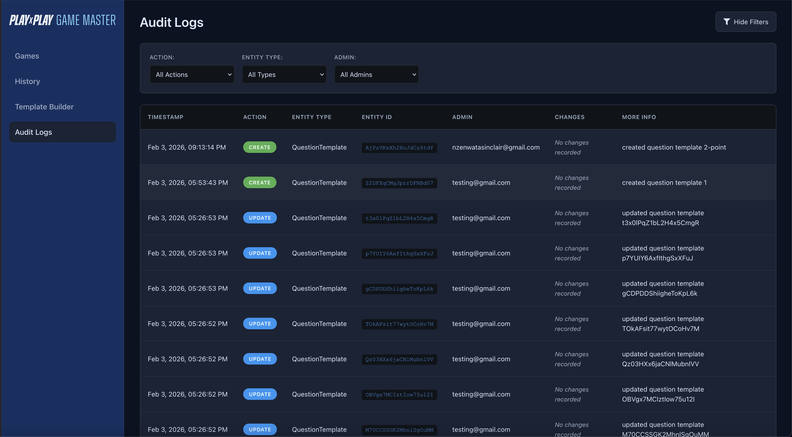

#### Step 1: Show Filters

1. Click the **"Show Filters"** button in the header
2. The filters section will expand

#### Step 2: Apply Filters

You can filter by:

- **Action**: CREATE, UPDATE, DELETE, or All Actions
- **Entity Type**:
    - Game
    - Badge
    - Badge Definition
    - Badge Assignment
    - Question
    - Question Template
    - User
    - Or All Types
- **Admin**: Current User or All Admins

#### Step 3: Clear Filters

1. Click the **"Clear Filters"** button (X icon) to remove all active filters
2. The table will show all audit logs again

### Viewing Change Details

1. Find the audit log entry you want to inspect
2. In the "Changes" column, click **"View Changes"**
3. A details section will expand showing:
    - **Before**: The state before the change
    - **After**: The state after the change
4. Click again to collapse the details

### Audit Log Table Columns

| Column      | Description                                   |
| ----------- | --------------------------------------------- |
| Timestamp   | Date and time of the action                   |
| Action      | Type of action (color-coded badge)            |
| Entity Type | Category of the affected item                 |
| Entity ID   | Unique identifier (clickable code)            |
| Admin       | Admin email and name who performed the action |
| Changes     | Expandable before/after values                |
| More Info   | Reason or description of the action           |

### Important Notes for Audit Logs

- **Automatic Logging**: All administrative actions are automatically logged
- **No Deletion**: Audit logs cannot be deleted or modified
- **Filtering**: Use filters to find specific actions or track changes by admin
- **Change Tracking**: UPDATE actions show before/after values when available
- **Performance**: Large numbers of logs may take time to load
- **Retention**: Audit logs are retained indefinitely for compliance and tracking

---

## Keyboard Hotkeys

### Overview

Keyboard hotkeys allow you to quickly perform common actions without using the mouse. This can significantly speed up your workflow during active games.

### Available Hotkeys

#### Number Keys (1-9, 0)

**Function**: Select a question template from the list

**How to Use**:

- Press **1** through **9** to select the first through ninth question template
- Press **0** to select the tenth question template
- The question is immediately created and activated

**When Available**:

- Always available when viewing the Game Controls panel
- Works even when typing in form fields

**Example**:

- Press **3** to quickly activate the third question template in your list

#### Spacebar

**Function**: Close the active play window

**How to Use**:

- Press **Space** when a question is active (status: "Predictions OPEN")
- The play window will close, allowing you to select answers

**When Available**:

- Only works when there is an active question with status "active"
- Prevents default scrolling behavior

**Example**:

- After players have submitted predictions, press **Space** to close the question window

#### Enter Key

**Function**: Send selected answers

**How to Use**:

- Select one or more answer options
- Press **Enter** to submit the selected answers
- Answers are sent to all players immediately

**When Available**:

- Only works when you have selected at least one answer
- Works in form fields and throughout the interface

**Example**:

- After closing a question and selecting the correct answer, press **Enter** instead of clicking "Send Answers"

### Hotkey Reference Table

| Hotkey    | Action                             | When Available            |
| --------- | ---------------------------------- | ------------------------- |
| **1-9**   | Select question template (1st-9th) | Always                    |
| **0**     | Select question template (10th)    | Always                    |
| **Space** | Close play window                  | When question is active   |
| **Enter** | Send selected answers              | When answers are selected |

### Combination Hotkeys (New)

Some workflows support combination hotkeys (example: `Shift + 1`). Refer to the in-app hotkey cheatsheet/settings for the current mappings.

---

## Theme Toggle

### Overview

The Theme Toggle feature allows you to switch between light and dark modes.

### Accessing Theme Toggle

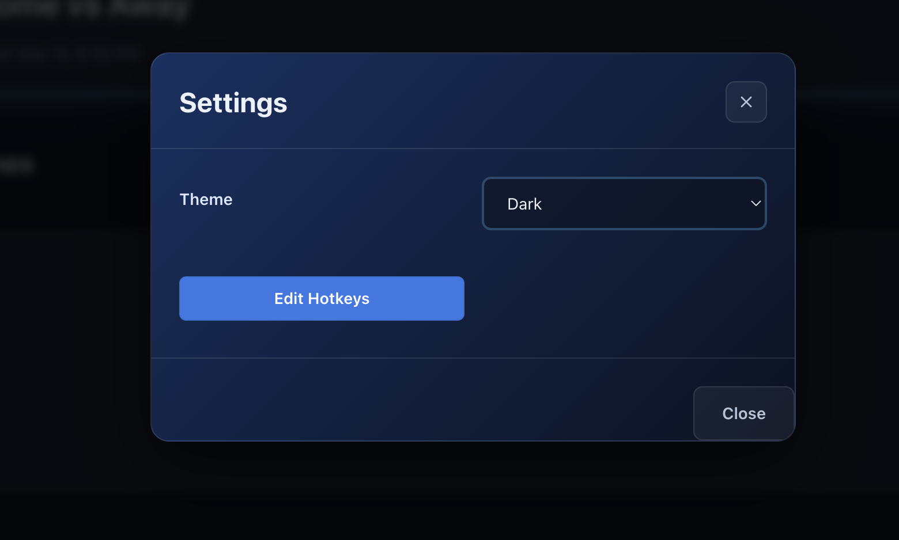

1. From the Home Page, click on the settings gear icon in the left sidebar
2. Select a theme from the available options

### Theme Toggle Page Layout

The Theme Toggle page displays:

- **Header**: "Theme Toggle" title
- **Theme Toggle Section**: Light and dark mode toggle buttons

### Understanding Theme Toggle

The Theme Toggle feature allows you to switch between light and dark modes.

- **Light Mode**: Default mode with a light background and dark text
- **Dark Mode**: Dark mode with a dark background and light text
- **Sepia Mode**: Sepia mode with a warm brownish background
- **Midnight Mode**: Midnight mode with a dark blue background
- **High Contrast Mode**: High contrast mode with a black background and white text

### Important Notes for Theme Toggle

- **Immediate Effect**: Changes take effect immediately during gameplay
- **Device-Specific**: Themes are saved per device/browser
- **Performance**: Using themes can significantly speed up your workflow during games

---

## Draft system

Save an incomplete game as a **draft**, then come back later to edit it and finish creating/scheduling it.

- **Where to use**: Home → Drafts section; Create Game modal → Save Draft
- **Details**: See [Saving a Game as a Draft](#saving-a-game-as-a-draft-new)
- **Screenshot to add later**: `Documentation/images/drafts-section.png` / `Documentation/images/save-draft.png`

## AppView emulation

AppView better emulates the player mobile gameplay experience in the admin dashboard.

- **Details**: See [Left Panel: App View](#left-panel-app-view)
- **Screenshot**: `Documentation/images/admin_view.jpg`

## Live dashboard: game notes checklist

Keep a checklist during a live game (modal from the dashboard header).

- **Details**: See [Game Notes Checklist](#game-notes-checklist-new)
- **Screenshot**: `Documentation/images/gamenotes.jpg`

## Game History: search & filter

Search games by name and filter results (client-side).

- **Details**: See [Searching and Filtering](#searching-and-filtering-new)
- **Screenshot**: `Documentation/images/search.jpg`

## Question reordering

Reorder questions in a template/set using up/down arrow controls.

- **Details**: See [Reordering Questions](#reordering-questions-new)
- **Screenshot to add later**: `Documentation/images/template-reorder.png`

## Hotkey combinations

Hotkeys support combinations (example: `Shift + 1`), depending on your configured mappings.

- **Details**: See [Keyboard Hotkeys](#keyboard-hotkeys) and [Custom Hotkeys](#custom-hotkeys)
- **Screenshot to add later**: `Documentation/images/hotkey-cheatsheet.png`

## CSV / JSON export

Export data as CSV/JSON (and copy CSV where available). Exports should respect the same filters/search applied on screen.

- **Details**:
  - Game History: [Exporting CSV / JSON](#exporting-csv--json-new)
  - Audit Logs: [Exporting CSV / JSON](#exporting-csv--json-new-1)
- **Screenshot to add later**: `Documentation/images/history-export.png` / `Documentation/images/audit-export.png`

## Ending a Game

### Before You End the Game

Ensure you have:

- ✓ Asked all planned questions
- ✓ Announced final results
- ✓ Rewarded top players
- ✓ Checked and awarded achievement badges (click "Check & Award Badges" in Badge Manager)

### Step 1: Click End Game Button

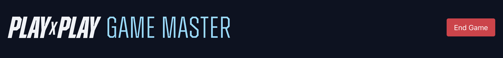

1. In the top navigation bar, click **"End Game"** button
2. A confirmation dialog will appear

### Step 2: Confirm Game Termination

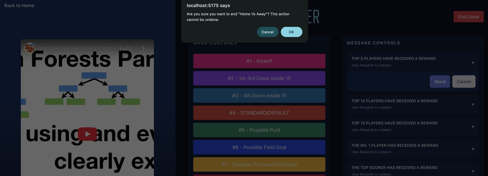

The dialog will show:

- Game name: "[Game Name] will be ended"
- Warning: "This action cannot be undone"
- Confirmation buttons: **"Cancel"** or **"Confirm"**

> **Warning**: Ending a game cannot be reversed. All active questions will be closed.

### Step 3: Game Ended

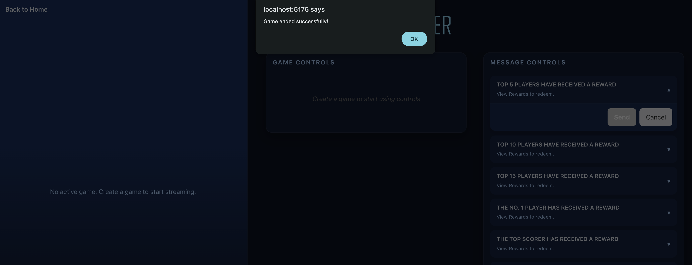

After confirmation:

- You are redirected to the Home Page

---

## FAQ

### General Questions

**Q: Can I use Play by Play Admin on mobile devices?**  
A: While the application may be accessible on mobile, it's optimized for desktop/laptop use. A tablet may work well for testing purposes.

**Q: How do I create a new account?**  
A: Click the "Register" link on the login page, fill in your email and password, and submit. After registration, you'll be redirected to the login page to sign in. See the [Registering a New Account](#registering-a-new-account) section for details.

**Q: Can I schedule games for later?**  
A: Yes! When creating a game, check the "Schedule for later" checkbox and select a future date and time. The game will appear in your Scheduled Games section. See the [Managing Scheduled Games](#managing-scheduled-games) section for details.

**Q: Do scheduled games start automatically?**  
A: No, scheduled games do not start automatically. You must manually click "Start Game Now" when you're ready to begin the game.

**Q: Can I edit a scheduled game?**  
A: Yes, you can edit scheduled games by clicking the Edit button on the game card. You can change the game name, URLs, template set, and scheduled time. However, you cannot convert a scheduled game to an immediate game or vice versa.

### Game Management

**Q: How long can a game session last?**  
A: As long as you need. Games can run for hours. Just remember to click "End Game" when finished.

**Q: What happens if I accidentally close the browser during a game?**  
A: Log back in immediately. Your game should still be active, and you can resume. Player data is preserved.

**Q: Can I have multiple games running simultaneously?**  
A: No, you can only have one active game at a time as an admin. You must end the current game before starting a new one.

**Q: Can I create questions that aren't in the template list?**  
A: Yes! Use the "+ Custom Question" button to create questions on-the-fly. You can optionally save them as templates for future use.

**Q: How do badges get awarded to players?**  
A: Badges with automatic criteria (points, accuracy, participation, perfect game) are awarded when you click "Check & Award Badges". Manual badges must be awarded by clicking the "Award" button on the badge.

**Q: Can I use keyboard shortcuts to speed up my workflow?**  
A: Yes! Press number keys (1-9, 0) to select questions, Space to close play windows, and Enter to send answers. See the [Keyboard Hotkeys](#keyboard-hotkeys) section for details.

**Q: What's the difference between game-specific and global badges?**  
A: Game-specific badges only apply to the current game. Global badges are available across all games and can be earned by players in any game session.

**Q: How do I organize my questions into sets?**  
A: Use the Template Builder feature to create question sets. You can organize questions by sport, event type, or any other category. See the [Template Builder](#template-builder) section for details.

**Q: Can I reuse questions from previous games?**  
A: Yes! Questions created in the Template Builder can be reused across multiple games. When creating a game, you can select a template set to pre-populate questions.

**Q: How do I view my past games?**  
A: Click "History" in the sidebar to see all your ended games. You can view detailed statistics and information about each game. See the [Game History](#game-history) section for details.

**Q: What are audit logs and why are they important?**  
A: Audit logs track all administrative actions in the system, including who performed what action and when. This helps maintain accountability and troubleshoot issues. See the [Audit Logs](#audit-logs) section for details.

**Q: Can I edit or delete audit logs?**  
A: No, audit logs are read-only and cannot be modified or deleted. They serve as a permanent record of all administrative actions.

**Q: How do I rename a question set?**  
A: Open the Set Dashboard for the set you want to rename, click the "Rename" button, enter the new name, and save. Note that this updates all questions in the set. See the [Template Builder](#template-builder) section for details.

---

## Document Information

**Last Updated**: December 2025  
**Version**: 3.0  
**For**: Play by Play Admin Users

### Version History

- **Version 3.0** (December 2025): Added Template Builder, Game History, and Audit Logs features
- **Version 2.0** (Previous): Achievement Badge System and Custom Questions
- **Version 1.0** (Initial): Core game management features
